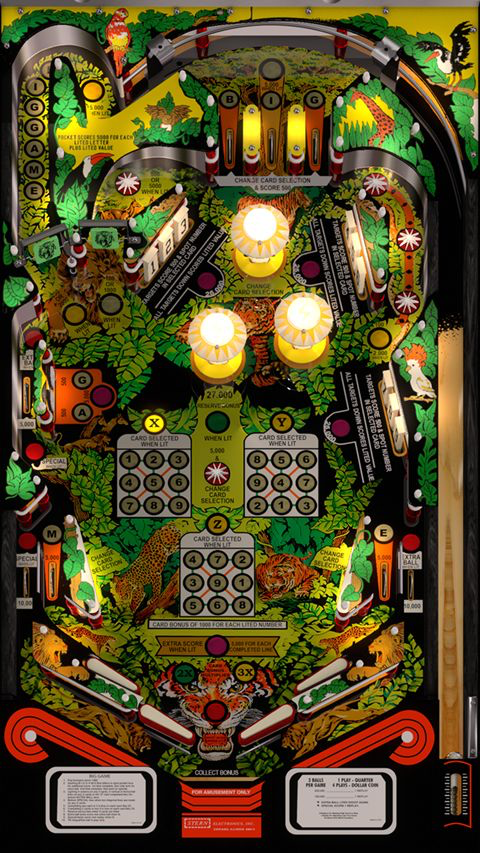

# Big Game (Stern 1980)

**Table**

Author: [JPSalas](https://www.vpforums.org/index.php?showuser=277)  
Version: 5.5.1  
Download: [VPForums](https://www.vpforums.org/index.php?app=downloads&showfile=12920)

**DirectB2S**

Author: [Blacksad](https://vpuniverse.com/profile/9127-blacksad/)  
Download: [VP Universe](https://vpuniverse.com/files/file/17853-big-game-stern-1980-b2s-with-full-dmd/)

**ROM**

Filename: biggame.zip  
Download: [VP Universe](https://vpuniverse.com/files/file/750-big-game-stern-1980/)  

SHA: bac2245363c73701ee5f02c9f1771c6c635588b5  
MD5: b481cc8b558b5d83e601b15e7c42367a

Tested by: Bla1ze

## Status 

Minimum VPX Standalone build: 10.8.0-2042-1431983
| Playfield | Controls | Backglass | DMD | ROM Required | FPS | 
|-----------|----------|-----------|-----|--------------|-----|
| :white_check_mark: | :white_check_mark: | :white_check_mark: | :x: | :white_check_mark: | 60 |

## Instructions

- Make sure to use the Table Manager to install this table.
- Instructions can be found on the wiki [Add Table - Manual](https://github.com/LegendsUnchained/vpx-standalone-alp4k/wiki/%5B04%5D-%F0%9F%A7%A1-TM-%E2%80%90-Other-Features#add-table---manual)
- If the table requires any additional files/steps, click `GO TO TABLE` after adding, and the TM will open to the relevant table folder.
- "So big: it's making pinball history." 🐯

