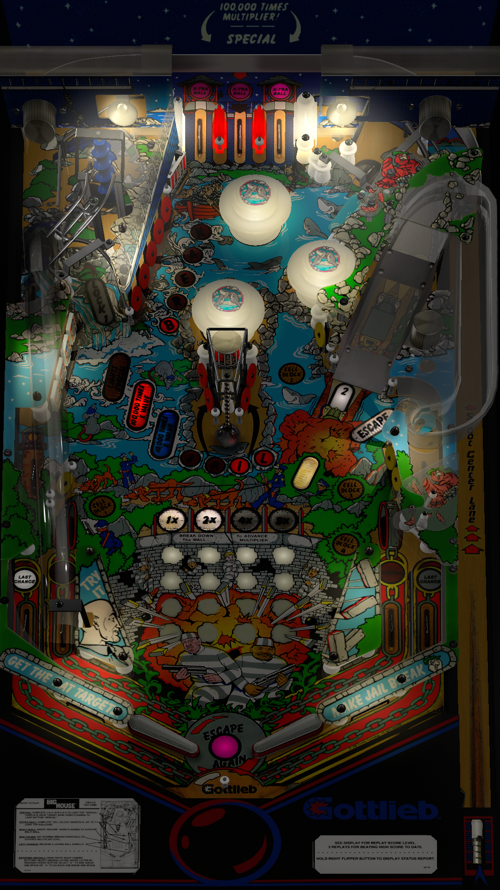

# Big House (Gottlieb 1989)

Authors: [Aubrel](https://vpuniverse.com/profile/257-aubrel/) [rascal](https://vpuniverse.com/profile/8-rascal/)
Version: 2.3
Download: [VP Universe](https://vpuniverse.com/files/file/6210-big-house-gottlieb-1989-mod/)

DirectB2S

Authors: [hauntfreaks](https://vpuniverse.com/profile/5216-hauntfreaks/)
Version: 1.0
Download: [VP Universe](https://vpuniverse.com/files/file/17990-big-house-gottlieb-1989-b2s/)

ROM

Download: [Pinball Nirvana](https://pinballnirvana.com/forums/resources/bighouse.1568/) Filename: bighouse.zip

## Status 

Minimum VPX Standalone build: 10.8.0-1989-a764013
| Playfield | Controls | Backglass | DMD | ROM Required | FPS | 
|-----------|----------|-----------|-----|--------------|-----|
| :white_check_mark: | :white_check_mark: | :white_check_mark: | :x: | :white_check_mark: | 32 |

## Instructions

- Install this table through the Table Manager, using the `Add Table` > `Manual` page
- If you need help, more infomation found on the wiki: [TM - Add Table - Manual](https://github.com/LegendsUnchained/vpx-standalone-alp4k/wiki/%5B04%5D-%F0%9F%A7%A1-TM-%E2%80%90-Other-Features#add-table---manual)
- If the table requires any additional files/steps, click `GO TO TABLE` after adding, and the TM will open to the relevant table folder.

