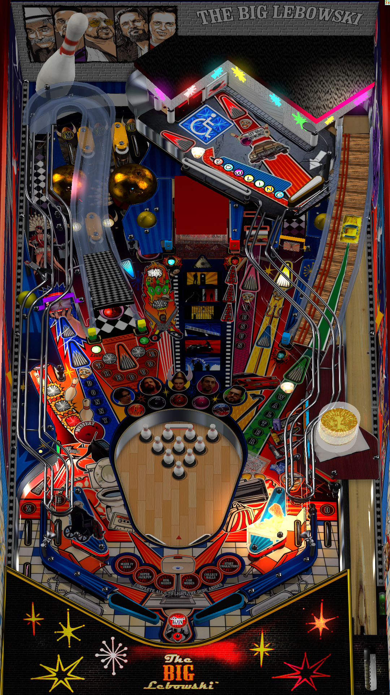

# Big Lebowski (2025)

## Files
| File Type | Link | Version | Author | 
|-----------|--------|----------|--------------|
| **VPX** | [VPUniverse](https://vpuniverse.com/files/file/23627-big-lebowski/) | 3.3 | [Marty02](https://vpuniverse.com/profile/16531-marty02/) |
| **B2S** | [VPUniverse](https://vpuniverse.com/files/file/23679-big-lebowski-dutch-ish-2019-b2s-full-dmd/) | 1.0 | [Hauntfreaks](https://vpuniverse.com/profile/5216-hauntfreaks/) |
| **DMD** | Included In Download | Included In Download | Included In Download |
| **ROM** | Not Needed| Not Needed | Not Needed|

**Tested by:** Bla1ze

---

## Status 
**Minimum VPX Standalone build:** 10.8.0-1989-a764013
| Playfield | Controls | Backglass | DMD | ROM Required | FPS | 
|-----------|----------|-----------|-----|--------------|-----|
| :white_check_mark: | :white_check_mark: | :white_check_mark: | :white_check_mark: | :x: | 50 |

---

## Instructions

- Make sure to use the Table Manager to install this table.
- Instructions can be found on the wiki [Add Table - Manual](https://github.com/LegendsUnchained/vpx-standalone-alp4k/wiki/%5B04%5D-%F0%9F%A7%A1-TM-%E2%80%90-Other-Features#add-table---manual)
- If the table requires any additional files/steps, click `GO TO TABLE` after adding, and the TM will open to the relevant table folder.
- I'm the Dude. So that's what you call me. You know, that or, uh, His Dudeness, or uh, Duder, or El Duderino if you're not into the whole brevity thing.

