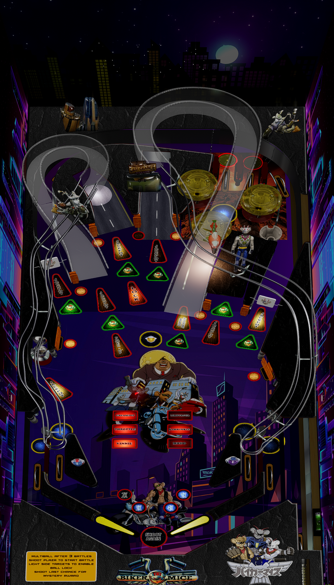

# Biker Mice From Mars

Author: [masonou](https://vpuniverse.com/profile/32420-masonou/)  
Version: Biker Mice From Mars (Original 2024)  
Download: [VP Universe](https://vpuniverse.com/files/file/21747-biker-mice-from-mars/)

Pup files included with table download

DirectB2S:  
Not Required

ROM:  
Not Required

Tested by:  
[Silentkat]

*****Table might crash if left on attract mode after a few minutes*****

## Status 

Minimum VPX Standalone build: 10.8.0-1983-b84441e

| Playfield | Controls | Backglass | DMD | ROM Required | FPS | 
|-----------|----------|-----------|-----|--------------|-----|
| :white_check_mark: | :white_check_mark: | :x: | :x: | :x: | 47 |

---

 

<table>
  <tr>
    <td style="background-color: #FFDDDD; padding: 0; border-left: 4px solid #FF0000;">
      

        <strong>⚠️ WARNING ⚠️</strong>
      

      

        Manually added puppacks are not supported by the VPXS 4KP team 
		We will not be able to help you diagnose issues until this puppack is in the Wizard 
		You can however find a guide here on the wiki to help you install it yourself: <a href="https://github.com/LegendsUnchained/vpx-standalone-alp4k/wiki/%5B08%5D-%E2%9D%A4%EF%B8%8F-Pup-Pack-%E2%80%90-Manual-Install">❤️ Pup Pack ‐ Manual Install</a>
      

    </td>
  </tr>
</table>

## Instructions

- Copy the contents of this repo folder to your USB drive
- Add your personalized launcher.elf and rename it to vpx-bikermice.elf
- Download table, unzip, open, and copy the vpx into external/vpx-bikermice
- Do not copy .ini use one in repo folder that is already there
- Make sure (.vpx) (.vbs) and (.ini) are all named the same
- In vpx-bikermice root folder make folder called pupvideos - copy Biker Mice folder from table download in to the pupvideos folder and rename it bikermicefrommars
- From your vpx-bikermice folder, unzip the use_these_pup_files.zip and place them inside the pupvideos/bikermicefrommars folder, and overwrite files if prompted
- Guys, let me tell you something. In this wild and woolly universe of ours, there's only three things you can count on: You brains, your bros... and your bike!
