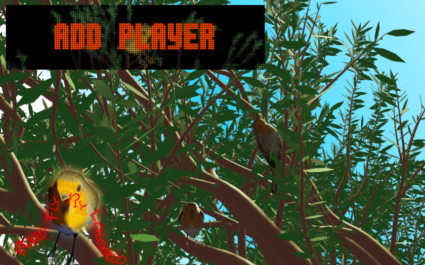

# Bird Fly (Original 2022)

Authors: [loloallo](https://www.vpforums.org/index.php?showuser=160835)  
Download File Name: Bird_Fly.0.9.0_VPX10.7.zip  
Filename: Bird_Fly.vpx  
Download: [VP Forums](https://www.vpforums.org/index.php?app=downloads&showfile=16555)

DirectB2S included with Table.rar file.

No ROM Needed

Music File

Download File Name: Bird_Fly_Music_folder.zip  
File Name: Bird_Fly  
Download: [VP Forums](https://www.vpforums.org/index.php?app=downloads&showfile=16555)

Tested by: TechZombie

## Status 

Minimum VPX Standalone build: 10.8.0-1989-a764013

| Playfield | Controls | Backglass | DMD | ROM Required | FPS | 
|-----------|----------|-----------|-----|--------------|-----|
| :white_check_mark: | :white_check_mark: | :white_check_mark: | :x: | :white_check_mark: | 52 |

## Instructions

- Make sure to use the Table Manager to install this table.
- Instructions can be found on the wiki [Add Table - Manual](https://github.com/LegendsUnchained/vpx-standalone-alp4k/wiki/%5B04%5D-%F0%9F%A7%A1-TM-%E2%80%90-Other-Features#add-table---manual)
- If the table requires any additional files/steps, click `GO TO TABLE` after adding, and the TM will open to the relevant table folder.
- Select/Copy Bird_Fly Folder and move to external/vpx-birdfly/music
- Unzip Bird_Fly_Music_folder.zip. Copy unzipped Bird_Fly.DMD folder to external/vpx-birdfly

