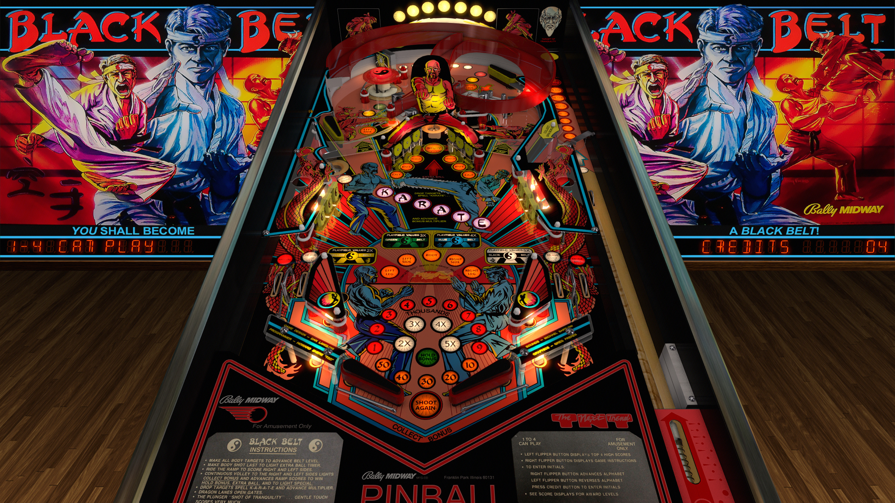

# Black Belt (Bally 1986)

Authors: [jpsalas](https://www.vpforums.org/index.php?showuser=277)\
Version: 4.0.0\
Download: [VPForums](https://www.vpforums.org/index.php?app=downloads&showfile=14821)

#### DirectB2S

Authors: [Wildman](https://vpuniverse.com/profile/5-wildman/)\
Version: 1.0\
Download: [VPUniverse](https://vpuniverse.com/files/file/5916-black-belt-bally-1986/)

#### ROM

Download: [VPForums](https://www.vpforums.org/index.php?app=downloads&showfile=247)\
ROM Name and version: `blackblt`

Tested by: [GyroJoe](https://github.com/GyroJoe)

## Status 

Minimum VPX Standalone build: 10.8.0-2026-3b68d7c
| Playfield | Controls | Backglass | DMD | ROM Required | FPS | 
|-----------|----------|-----------|-----|--------------|-----|
| :white_check_mark: | :white_check_mark: | :white_check_mark: | :white_check_mark: | :white_check_mark: | 55 |

## Instructions

- Make sure to use the Table Manager to install this table.
- Instructions can be found on the wiki [Add Table - Manual](https://github.com/LegendsUnchained/vpx-standalone-alp4k/wiki/%5B04%5D-%F0%9F%A7%A1-TM-%E2%80%90-Other-Features#add-table---manual)
- If the table requires any additional files/steps, click `GO TO TABLE` after adding, and the TM will open to the relevant table folder.
- "Go for your BLACK BELT today!"

