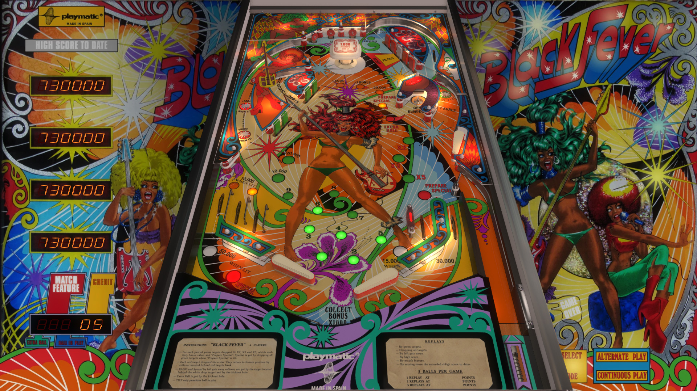

# Black Fever (Playmatic 1980)

Author: [pedator](https://www.vpforums.org/index.php?showuser=141813)  
Version: 1.0   
Black Fever (Playmatic 1980).zip  
Download: [vpforums](https://www.vpforums.org/index.php?app=downloads&showfile=18810)

DirectB2S  
Author: [pedator](https://www.vpforums.org/index.php?showuser=141813)    
Version 1.0   
Black Fever (Playmatic 1980) directb2s.zip  
Download: [vpforums](https://www.vpforums.org/index.php?app=downloads&showfile=18810)

ROM  
Download: [vpforums](https://www.vpforums.org/index.php?app=downloads&showfile=3074)  
ROM Name and version: blkfever.zip  

  
Tested by:  
[psybocilin]

## Status 

Minimum VPX Standalone build: 10.8.0-1989-a764013

| Playfield | Controls | Backglass | DMD | ROM Required | FPS | 
|-----------|----------|-----------|-----|--------------|-----|
| :white_check_mark: | :white_check_mark: | :white_check_mark: | :x: | :white_check_mark: | 50 |

## Instructions

- Install this table through the Table Manager, using the `Add Table` > `Manual` page
- If you need help, more infomation found on the wiki: [TM - Add Table - Manual](https://github.com/LegendsUnchained/vpx-standalone-alp4k/wiki/%5B04%5D-%F0%9F%A7%A1-TM-%E2%80%90-Other-Features#add-table---manual)
- If the table requires any additional files/steps, click `GO TO TABLE` after adding, and the TM will open to the relevant table folder.

