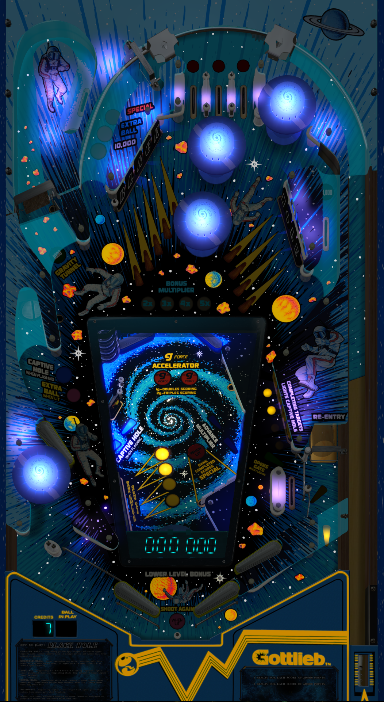

# Black Hole (Gottlieb 1981)

Authors: [Bigus1](https://www.vpforums.org/index.php?showuser=107629)  
Version: 1.0  
Download: [VPForums](https://www.vpforums.org/index.php?app=downloads&showfile=17369)

DirectB2S

Authors: [cyberpez](https://www.vpforums.org/index.php?showuser=73048)  
Download: [VPForums](https://www.vpforums.org/index.php?app=downloads&showfile=10929)

ROMs

ROM Name: blckhole.zip  
Download: [Pinball Nirvana](https://pinballnirvana.com/forums/resources/blckhole.1582/)

SHA1: 58FBBB689B2FAD56B42E2985171109BA55C1BA12  
MD5:  5CAD19B76FA44C3B471CB260AAA18030

ROM Name: blkhole7.zip  
Download: [Pinball Nirvana](https://pinballnirvana.com/forums/resources/blkhole7.1586/)

SHA1: 9601066B1B0D1CE458C9FAA19337A21B268A824B  
MD5:  B6924222A2E45D540B4C726AA5BF2673

Tested by: evilwraith

## Status 

Minimum VPX Standalone build: 10.8.0-1989-a764013

| Playfield | Controls | Backglass | DMD | ROM Required | FPS | 
|-----------|----------|-----------|-----|--------------|-----|
| :white_check_mark: | :white_check_mark: | :white_check_mark: | :white_check_mark: | :white_check_mark: | 30 |

## Instructions

- The ROM zip files get copied to vpx-blackhole/pinmame/roms (Do not unzip)
