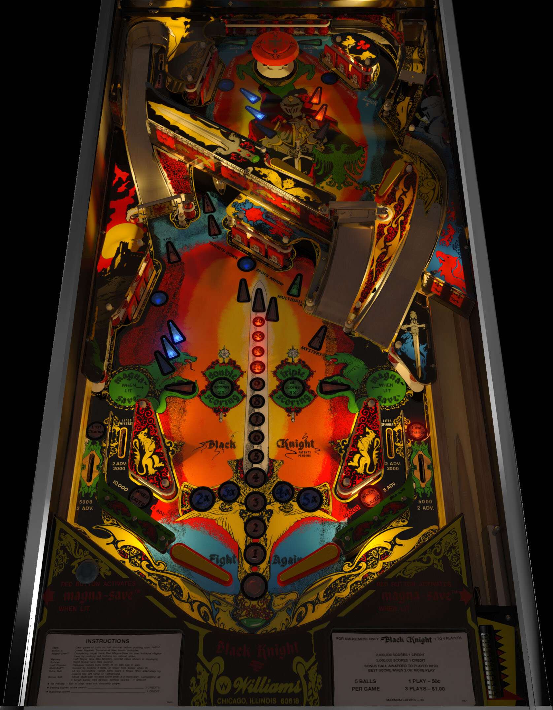

# Black Knight (Williams 1980)

Authors: [bord](https://vpuniverse.com/profile/9265-bord/)
Version: 3.0
Download: [VPUniverse](https://vpuniverse.com/files/file/7629-black-knight-williams-1980/)

DirectB2S

Authors: [blacksad](https://vpuniverse.com/profile/9127-blacksad/)
Version: 1.0.0
Download: [VPUniverse](https://vpuniverse.com/files/file/5678-black-knight-williams-1980-2-3-screens-directb2s-b2s-db2s/)

ROM

Download: [vpforums](https://www.vpforums.org/index.php?app=downloads&showfile=140)
ROM Name and version: bk_l4.zip

## Status 

Minimum VPX Standalone build: 10.8.0-1989-a764013
| Playfield | Controls | Backglass | DMD | ROM Required | FPS | 
|-----------|----------|-----------|-----|--------------|-----|
| :white_check_mark: | :white_check_mark: | :white_check_mark: | :white_check_mark: | :white_check_mark: | 60 |

## Instructions

- Copy the contents of this repo folder to your USB drive
- Add your personalized launcher.elf and rename it to vpx-blackknight.elf
- Download the table and directb2s versions listed above and copy them into this folder
- Make sure the vpx, direct2b, and ini files are all named the "exact" same
- Place bk_l4.zip in the external/vpx-blackknight/pinmame/roms folder *Do Not unzip*
- "Can you defeat the Black Knight?"

