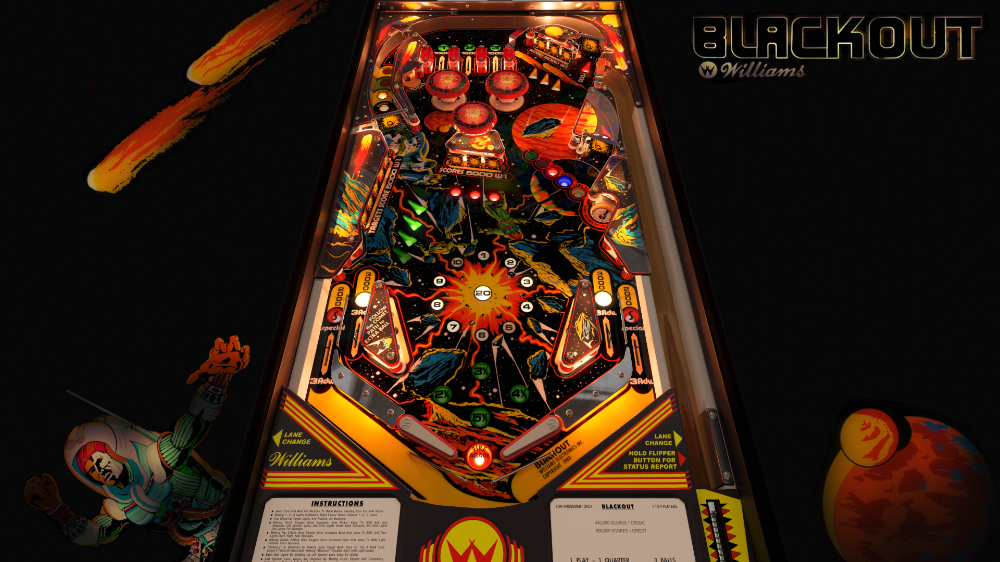

# Blackout (Williams 1980)

Authors: [unclewilly](https://www.vpforums.org/index.php?showuser=12)
Version: 1.3
Download: [vpforums](https://www.vpforums.org/index.php?s=50af10719051bb9819a689fdf3cb2a3e&app=downloads&showfile=18393)

DirectB2S

Authors: [wildman](https://vpuniverse.com/profile/5-wildman/)
Version: 1.0.0
Download: [VPUniverse](https://vpuniverse.com/files/file/3083-blackout-williams-1980/)

ROM

Download: [vpforums](https://www.vpforums.org/index.php?app=downloads&showfile=781)
ROM Name and version: blkou_l1.zip

## Status 

Minimum VPX Standalone build: 10.8.0-1989-a764013
| Playfield | Controls | Backglass | DMD | ROM Required | FPS | 
|-----------|----------|-----------|-----|--------------|-----|
| :white_check_mark: | :white_check_mark: | :white_check_mark: | :white_check_mark: | :white_check_mark: | 30 |

## Instructions

- Copy the contents of this repo folder to your USB drive
- Add your personalized launcher.elf and rename it to vpx-blackout.elf
- Download the table and directb2s versions listed above and copy them into this folder
- Make sure the vpx, direct2b, and ini files are all named the "exact" same
- Place blkou_l1.zip in the external/vpx-blackout/pinmame/roms folder *Do Not unzip*
- "Time for the Blackout"

