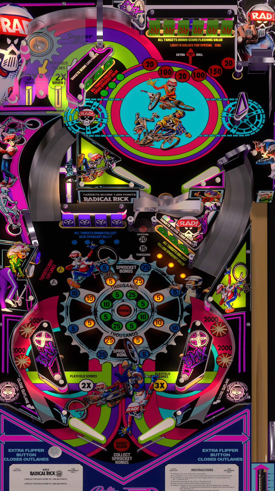

# BMX (Radical Rick) (Bally 1983)

Tested by: Mox

## Information
| File Type | Link | Version | Author(s) | 
|:---------:|:----:|:-------:|:---------:|
| VPX | [VP Universe](https://vpuniverse.com/files/file/20599-bmx-bally-1983-radical-rick-dtfsvr/) | 1.3 | [hauntfreaks](https://vpuniverse.com/profile/5216-hauntfreaks/) |
| DirectB2S | [VP Universe](https://vpuniverse.com/files/file/20598-bmx-bally-1983-radical-rick-b2s/) | 1.0 | [hauntfreaks](https://vpuniverse.com/profile/5216-hauntfreaks/) |
| ROM | [VP Universe](https://vpuniverse.com/files/file/1059-bmx-bally-1982/) | bmx | [VPUStaff](https://vpuniverse.com/profile/50-vpustaff/) |

## Status 
Minimum VPX Standalone build: 10.8.0-2006-6d603fb

| Playfield | Controls | Backglass | DMD | ROM Required | FPS | 
|:---------:|:--------:|:---------:|:---:|:------------:|:---:|
| :white_check_mark: | :white_check_mark: | :white_check_mark: | :white_check_mark: | :white_check_mark: | 55 |

## Instructions
- Copy the **vpx-bmx** folder to the `external` directory of your USB drive
- Add your personalized launcher.elf and rename it to **vpx-bmx**
- Download the **VPX** and **DIRECTB2S** versions listed above and copy them into the **vpx-bmx** folder
- Make sure (.vpx), (.directb2s), and (.ini) files are all named the same. Do NOT rename VPReg.ini file
- Download the **ROM** version listed above and copy it into `\vpx-bmx\pinmame\roms` (DO NOT UNZIP)
- "I don't crash, I do random gravity checks."

