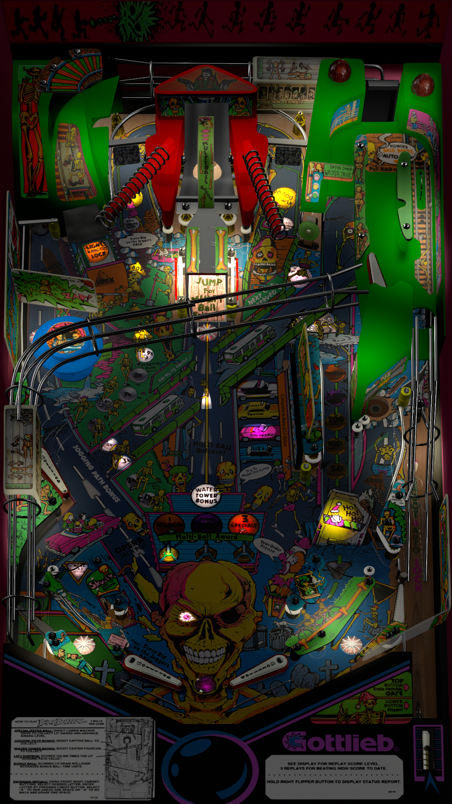

# Bone Busters Inc. (Gottlieb 1989)

Authors: [Aubrel](https://vpuniverse.com/profile/257-aubrel/)
Version: 1.6
Download: [VP Universe](https://vpuniverse.com/files/file/6777-bone-busters-inc-gottlieb-1989/)

DirectB2S

Authors: [hauntfreaks](https://vpuniverse.com/profile/5216-hauntfreaks/)
Version: 1.0
Download: [VP Universe](https://vpuniverse.com/files/file/11970-bone-busters-inc-gottlieb-1989-b2s-with-full-dmd/)

ROM

Download: [Pinball Nirvana](https://pinballnirvana.com/forums/resources/bonebstr.1611/)

## Status 

Minimum VPX Standalone build: 10.8.0-1989-a764013
| Playfield | Controls | Backglass | DMD | ROM Required | FPS | 
|-----------|----------|-----------|-----|--------------|-----|
| :white_check_mark: | :white_check_mark: | :white_check_mark: | :white_check_mark: | :white_check_mark: | 35 |

## Instructions

- Copy the contents of this repo folder to your USB drive
- Add your personalized launcher.elf and rename it to vpx-bonebusters.elf
- Download the table and directb2s versions listed above and copy them into this folder
