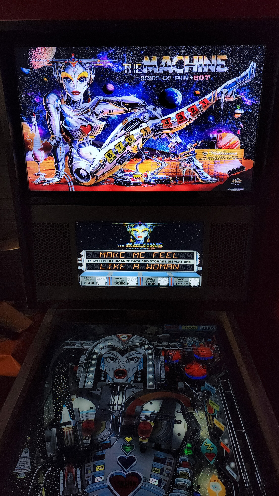

# The Machine Bride Of Pinbot (Williams 1991)

                 

Authors: [VPinWorkshop](https://vpuniverse.com/profile/40692-vpinworkshop//)  
Version: 1.0.4  
Download: [VPUniverse](https://vpuniverse.com/files/file/12029-the-machine-bride-of-pinbot-williams-1991-vpw-mod/)

DirectB2S

Authors: [hauntfreaks](https://vpuniverse.com/profile/5216-hauntfreaks/)  
Version: 2.1.1  
Download: [VPUniverse](https://vpuniverse.com/files/file/10689-the-machine-bride-of-pinbot-williams-1991-b2s-with-fulldmd/)

ROM
Version L-7
Download: [VP Forums](https://www.vpforums.org/index.php?app=downloads&showfile=1161)

SHA: 
MD5: 

## Status 

Minimum VPX Standalone build: 10.8.0-2006-6d603fb
| Playfield | Controls | Backglass | DMD | ROM Required | FPS | 
|-----------|----------|-----------|-----|--------------|-----|
| :white_check_mark: | :white_check_mark: | :white_check_mark: | :white_check_mark: | :white_check_mark: | 43 |

## Instructions

- Copy the contents of this repo folder to your USB drive
- Add your personalized launcher.elf and rename it to vpx-bop.elf
- Download the table, directb2s, and ROM versions listed above and copy them into this folder
- Make sure (.vpx), (.directb2s), (.ini) and (.vbs) files are all named the same
- Copy the original non-extracted zip file to the vpx-bop/pinmame/roms folder

