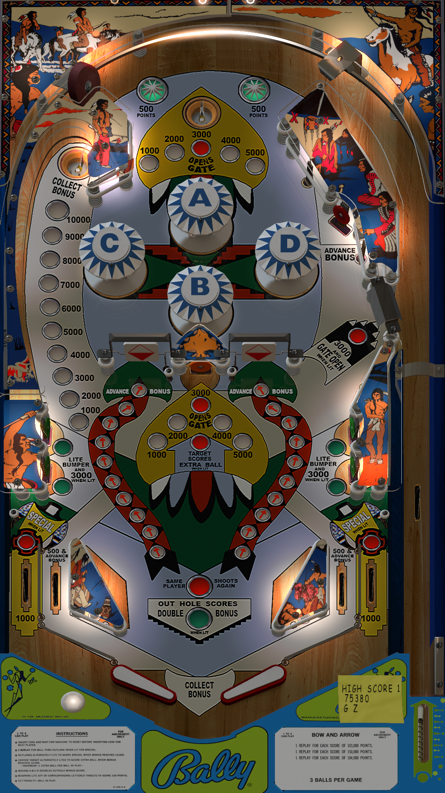

# Bow and Arrow EM (Bally 1975)

Authors: [Mustang1961](https://www.vpforums.org/index.php?showuser=101607)  
Version: 1.0c  
Download: [VPForums](https://www.vpforums.org/index.php?app=downloads&showfile=18312)

DirectB2S

Download included with table

ROM

None

Tested by: evilwraith

## Status 

Minimum VPX Standalone build: 10.8.0-1989-a764013

| Playfield | Controls | Backglass | DMD | ROM Required | FPS | 
|-----------|----------|-----------|-----|--------------|-----|
| :white_check_mark: | :white_check_mark: | :white_check_mark: | :x: | :x: | 48 |

## Instructions

- Make sure to use the Table Manager to install this table.
- Instructions can be found on the wiki [Add Table - Manual](https://github.com/LegendsUnchained/vpx-standalone-alp4k/wiki/%5B04%5D-%F0%9F%A7%A1-TM-%E2%80%90-Other-Features#add-table---manual)
- If the table requires any additional files/steps, click `GO TO TABLE` after adding, and the TM will open to the relevant table folder.

