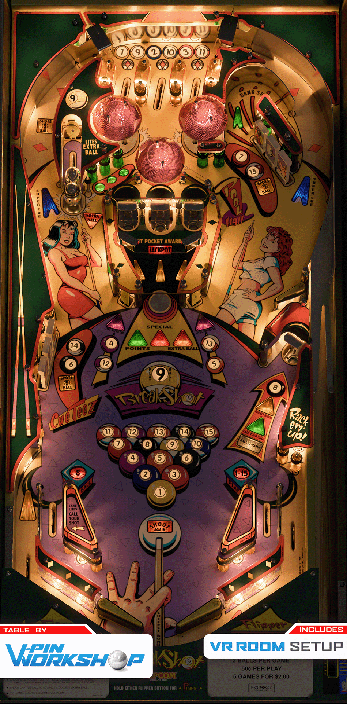

# Breakshot (capcom 1996)

Authors: [Vpinworkshop](https://vpuniverse.com/profile/40692-vpinworkshop/)
Version: 1.1
Download: [vpforums](https://vpuniverse.com/files/file/20471-breakshot-capcom-1996/)

DirectB2S

Authors: [wildman](https://vpuniverse.com/profile/5-wildman/)
Version: 3.0
Download: [VP Universe](https://vpuniverse.com/files/file/2286-breakshotcapcom-1996/)

ROM

Download: [vpforums](https://www.vpforums.org/index.php?app=downloads&showfile=142)
Rom Name: bsv103.zip

Alt Color

Authors: [kraken](https://vpuniverse.com/profile/35517-kraken/
Download: [VPUniverse](https://vpuniverse.com/files/file/20470-breakshot-serum-colorization/)
file name: bsv103.cRZ

## Status 

Minimum VPX Standalone build: 10.8.0-1989-a764013
| Playfield | Controls | Backglass | DMD | ROM Required | FPS | 
|-----------|----------|-----------|-----|--------------|-----|
| :white_check_mark: | :white_check_mark: | :white_check_mark: | :white_check_mark: | :white_check_mark: | 28 |

## Instructions

- Create "altcolor" folder in external/vpx-breakshot/pinmame/
- Create folder "bsv103" in external/vpx-breakshot/pinmame/altcolor
- Place bsv103.cRZ file inside external/vpx-breakshot/pinmame/altcolor/bsv103

