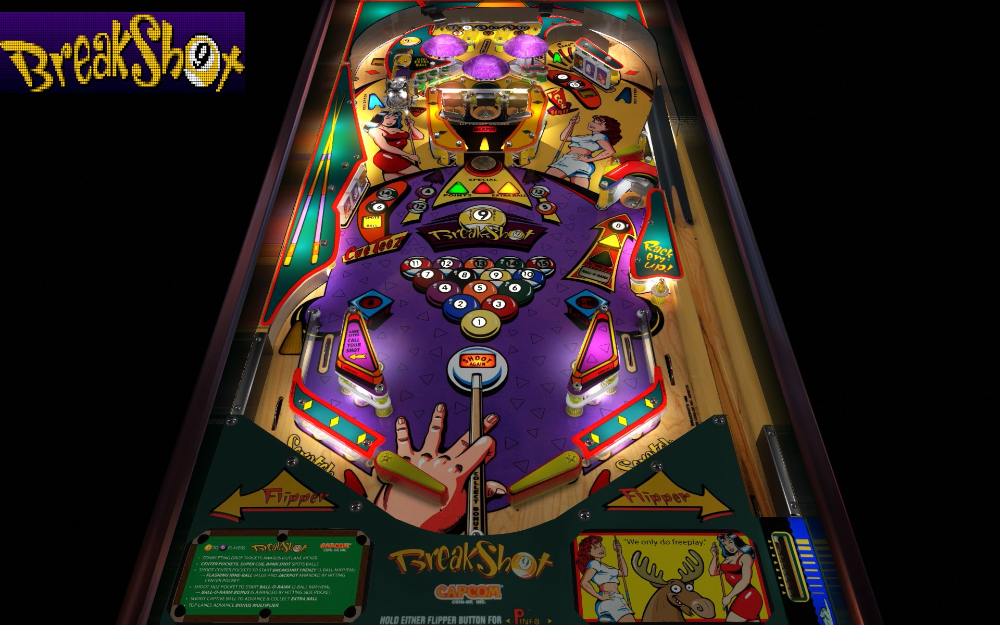

# Breakshot (Capcom 1996)

---

## Files
| File Type | Link | Version | Author | 
|-----------|--------|----------|--------------|
| **VPX** | [VP Forums](https://www.vpforums.org/index.php?app=downloads&showfile=14361) | 3.1.0 | [Bigus1](https://www.vpforums.org/index.php?showuser=107629) |
| **B2S** | [VP Universe](https://vpuniverse.com/files/file/20472-breakshot-capcom-1996-b2s-full-dmd/) | 1.0.0 | [Hauntfreaks](https://vpuniverse.com/profile/5216-hauntfreaks/) |
| **ROM** | [VP Forums](https://www.vpforums.org/index.php?app=downloads&showfile=142) | bsv103 | [destruk](https://www.vpforums.org/index.php?showuser=5) |
| **Color DMD** | [VP Universe](https://vpuniverse.com/files/file/20470-breakshot-serum-colorization/) | 1.0.1 | [KRAKEN](https://vpuniverse.com/profile/35517-kraken/) |

---

## Status 
Minimum VPX Standalone build: 10.8.0-1989-a764013

| Playfield | Controls | Backglass | DMD | ROM Required | FPS | 
|-----------|----------|-----------|-----|--------------|-----|
| :white_check_mark: | :white_check_mark: | :white_check_mark: | :white_check_mark: | :white_check_mark: | 45 |

---

## Instructions

- Download the color DMD zip, extract and copy the .cRZ file of your choice to path: `vpx-breakshotbigus/pinmame/altcolor/bsv103`
- Included nvram is set to Free Play.

---

**MD5**: 7ec9dae23d329e520624b7fdcfbd022d

**Tested by:** Shaver
