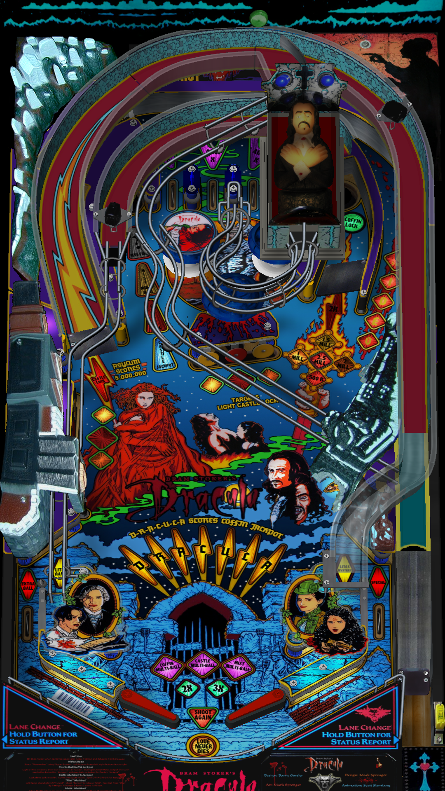

# Bram Stoker's Dracula (Williams 1993)

Authors: [CSilk](https://www.vpforums.org/index.php?showuser=162097)

Tested by: Bla1ze

Version: 1.6I

Download: [VP Forums](https://www.vpforums.org/index.php?app=downloads&showfile=17516)

DirectB2S

Authors: [hauntfreaks](https://vpuniverse.com/profile/5216-hauntfreaks/)

Version: 1.0.0

Download: [VP Universe](https://vpuniverse.com/files/file/12199-bram-stokers-dracula-williams-1993-b2s-with-full-dmd/)

ROM

ROM Name: drac_l1.zip

Download: [VP Forums](https://www.vpforums.org/index.php?app=downloads&showfile=1173)

SHA: 0122e6f44a2fcbd397c43a61aaad9cfffe681938
MD5: 66d63871f98b5efefd7a67c4189c6946

## Status 

Minimum VPX Standalone build: 10.8.0-1989-a764013
| Playfield | Controls | Backglass | DMD | ROM Required | FPS | 
|-----------|----------|-----------|-----|--------------|-----|
| :white_check_mark: | :white_check_mark: | :white_check_mark: | :white_check_mark: | :white_check_mark: | 40 |

## Instructions

- Copy the contents of this repo folder to your USB drive
- Add your personalized launcher.elf and rename it to vpx-bsdracula.elf
- Download the table, ROM and directb2s versions listed above and copy them into this folder
- Make sure (.vpx), (.directb2s), (.ini) and (.vbs) files are all named the same
- Place drac_l1.zip in the external/vpx-bsdracula/pinmame/roms folder *Do Not unzip*
- "The blood is the life!" 🩸
