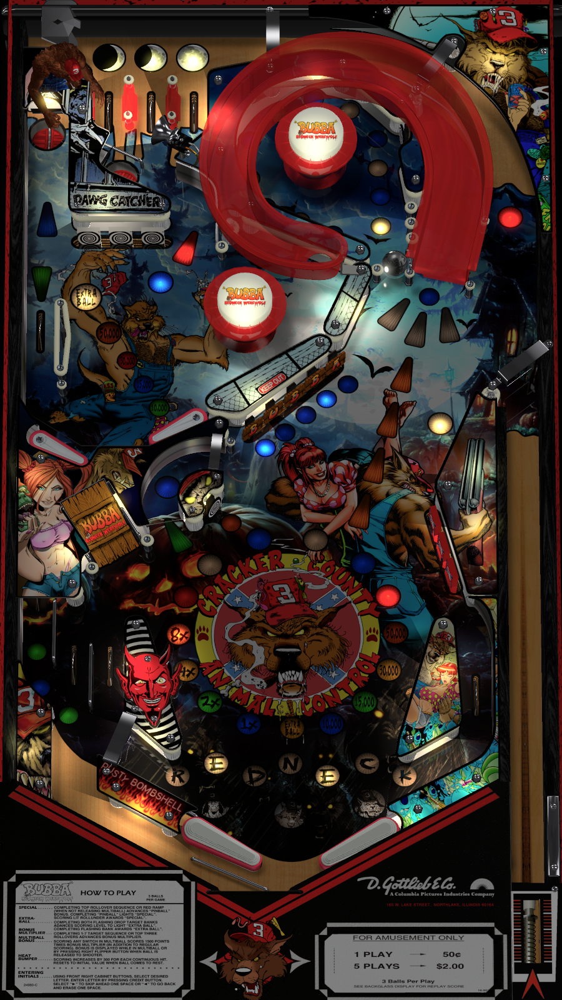

# Bubba the Redneck Werewolf (Original 2017)

Authors: [hauntfreaks](https://www.vpforums.org/index.php?showuser=73849)  
Filename: Bubba the Redneck Werewolf (2017)1.1.vpx  
Download: [VP Universe](https://www.vpforums.org/index.php?app=downloads&showfile=13158)

DirectB2S

Authors: [hauntfreaks](https://www.vpforums.org/index.php?showuser=73849)  
Filename: Bubba the Redneck Werewolf (HauntFreaks 2017) alt.directb2s  
Download: [VP Universe](https://vpuniverse.com/files/file/22036-bubba-the-redneck-werewolf-hauntfreaks-2017-alt-b2s/)

Custom ROM (hlywoodh.zip) is included in Table Pack

Tested by: TechZombie

## Status 

Minimum VPX Standalone build: 10.8.0-1989-a764013

| Playfield | Controls | Backglass | DMD | ROM Required | FPS | 
|-----------|----------|-----------|-----|--------------|-----|
| :white_check_mark: | :white_check_mark: | :white_check_mark: | :x: | :white_check_mark: | 40 |

## Instructions

- Copy the contents of this repo folder to your USB drive
- Add your personalized launcher.elf and rename it to vpx-bubbatheredneckwerewolf.elf
- Download the table and directb2s listed above, extract (if necessary) and copy them to external/vpx-bubbatheredneckwerewolf
- Make sure (.vpx), (.directb2s), (.ini), and (.vbs) files are all named the same
- Rom file (hlywoodh.zip) stays in zip folder, place zip file in vpx-bubbatheredneckwerewolf/pinmame/roms
- In the town of "Broken Taint" located in Cracker County Fla (The land that time forgot and is damn proud of it!) - Bubba

