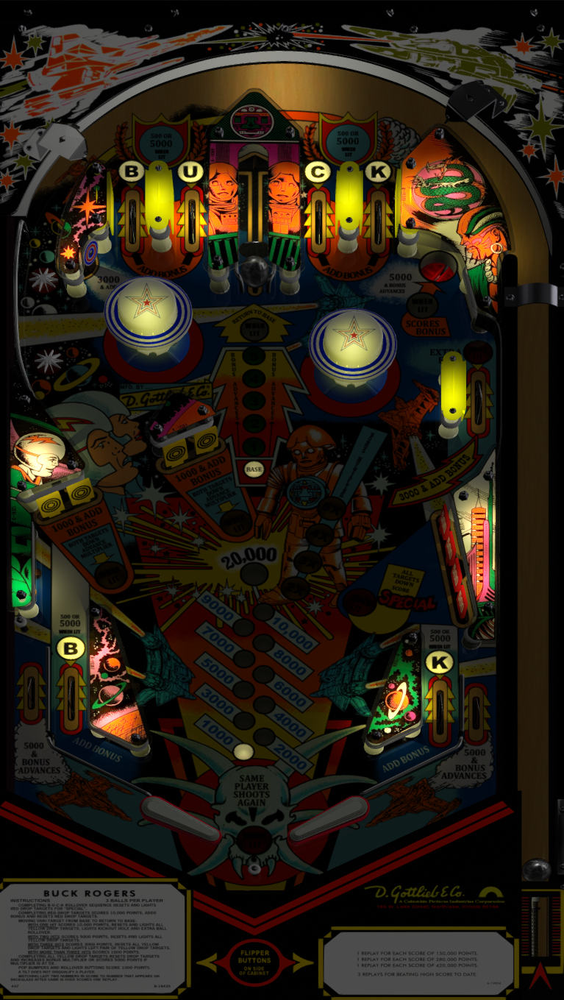

# Buck Rogers (Gottlieb 1980) Sound MOD

Author(s): [xenonph](https://www.vpforums.org/index.php?showuser=14100)  
Version: Buck Rogers (Gottlieb 1980) Sound MOD v2.1.zip
Download:  [VP Forums](https://www.vpforums.org/index.php?app=downloads&showfile=13137)

DirectB2S

Version: Buck Rogers (Gottlieb 1980)1.0

Author(s): [hauntfreaks ](https://vpuniverse.com/profile/5216-hauntfreaks/)  
Download:  [VPUniverse](https://vpuniverse.com/files/file/14150-buck-rogers-gottlieb-1980-b2s/)

ROM:
buckrgrs.zip

Author(s): [VPUStaff]  
Download:  [VPUniverse](https://vpuniverse.com/files/file/1368-buck-rogers/)

Tested by:
[TechZombie]

## Status 

Minimum VPX Standalone build: 10.8.0-1983-b84441e
| Playfield | Controls | Backglass | DMD | ROM Required | FPS | 
|-----------|----------|-----------|-----|--------------|-----|
| :white_check_mark: | :white_check_mark: | :white_check_mark: | :white_check_mark: | :white_check_mark: | 50 |

## Instructions

- Make sure to use the Table Manager to install this table.
- Instructions can be found on the wiki [Add Table - Manual](https://github.com/LegendsUnchained/vpx-standalone-alp4k/wiki/%5B04%5D-%F0%9F%A7%A1-TM-%E2%80%90-Other-Features#add-table---manual)
- If the table requires any additional files/steps, click `GO TO TABLE` after adding, and the TM will open to the relevant table folder.
- "I'm freezing my ball-bearings off!" --Twiki

