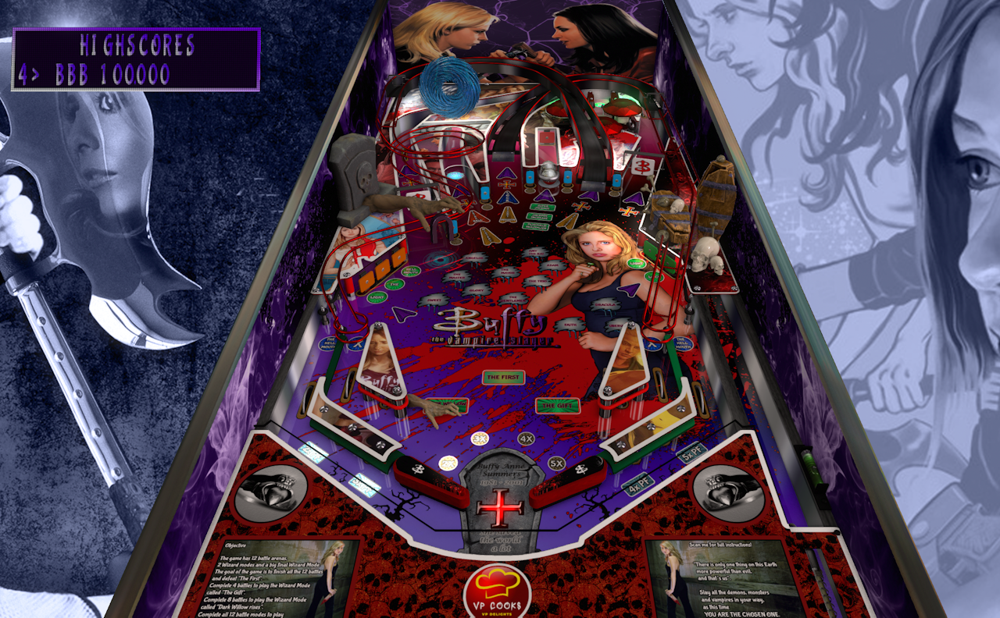

# Buffy The Vampire Slayer (Original 2022)

Authors: [VP_Cooks](https://vpuniverse.com/profile/33960-vp_cooks/)  
Filename: Buffy The Vampire Slayer_VP_Cooks.vpx  
Download: [VP Universe](https://vpuniverse.com/files/file/11811-buffy-the-vampire-slayer-vp_cooks/)

DirectB2S Included with Table Pack  
Filename: Buffy The Vampire Slayer_VP_Cooks.directb2s

No ROM Needed

Tested by: TechZombie

## Status 

Minimum VPX Standalone build: 10.8.0-1989-a764013

| Playfield | Controls | Backglass | DMD | ROM Required | FPS | 
|-----------|----------|-----------|-----|--------------|-----|
| :white_check_mark: | :white_check_mark: | :white_check_mark: | :white_check_mark: | :x: | 52 |

## Instructions

- Install this table through the Table Manager, using the `Add Table` > `Manual` page
- If you need help, more infomation found on the wiki: [TM - Add Table - Manual](https://github.com/LegendsUnchained/vpx-standalone-alp4k/wiki/%5B04%5D-%F0%9F%A7%A1-TM-%E2%80%90-Other-Features#add-table---manual)
- If the table requires any additional files/steps, click `GO TO TABLE` after adding, and the TM will open to the relevant table folder.
- "In every generation there is a Chosen One. She alone will stand against the vampires, the demons and the forces of darkness. She is the Slayer." - Giles

