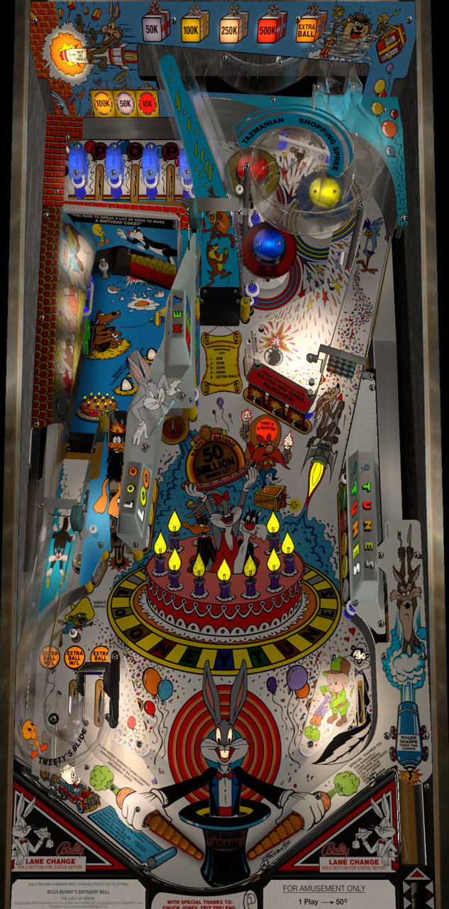

# Bugs Bunny Birthday Ball (Bally 1991)

Author: [wrd1972](https://vpuniverse.com/profile/7788-wrd1972/) 

Tested by: Bla1ze

Version: 2.3b

Download: [VP Universe](https://vpuniverse.com/files/file/14364-bugs-bunnys-birthday-ball-bally-1991/)

DirectB2S

Author: [Hauntfreaks](https://vpuniverse.com/profile/5216-hauntfreaks/)  

Version: 1.0.0

Download: [VP Universe](https://vpuniverse.com/files/file/17218-bugs-bunny-birthday-ball-bally-1989-alt-b2s-with-full-dmd/)

ROM

Download: [VP Forums](https://www.vpforums.org/index.php?app=downloads&showfile=954)

SHA: c2eeb0d4100a0e82af91e9d8eb50a34e69a1710d

MD5: 970d59cad33064953f538147a4298a9e

Alt Color

Author: [ebor](https://vpuniverse.com/profile/29168-ebor/)  

Version: 1.0.0

Download: [VP Universe](https://vpuniverse.com/files/file/15841-bugs-bunny-birthday-ball-bally-1991-dmd-64-colors-serum-format/)

## Status 

Minimum VPX Standalone build: 10.8.0-1983-a764013
| Playfield | Controls | Backglass | DMD | FPS | 
|-----------|----------|-----------|-----|----------|
| :white_check_mark: | :white_check_mark: | :white_check_mark: | :white_check_mark: | 40 |

## Instructions

- Copy the contents of this repo folder to your USB drive
- Add your personalized launcher.elf and rename it to vpx-bugs.elf
- Download the table, ROM and directb2s versions listed above and copy them into this folder
- If using the Alt Color, make an altcolor folder in the pinmame folder, then make a bbnny_l2 folder and place the bbnny_l2.cRZ inside
- That's all folks!
