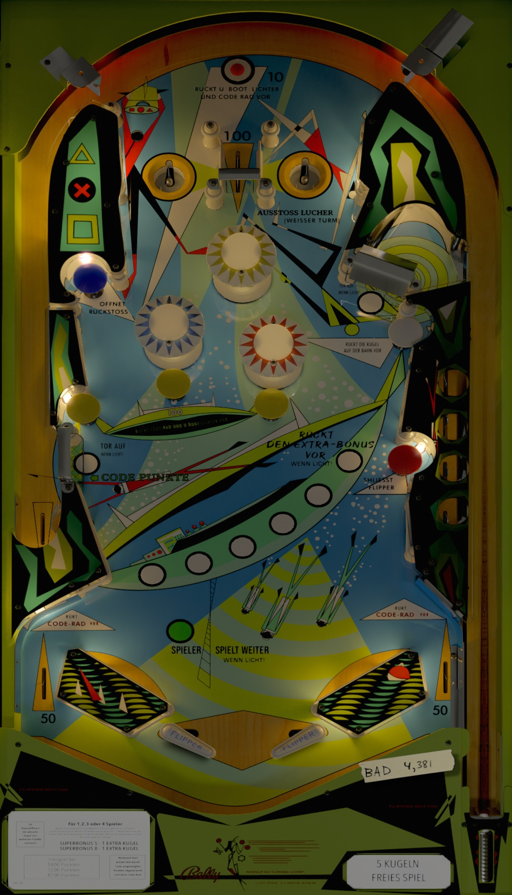

# Capersville (Bally 1966)

Authors: [Scottacus](https://vpuniverse.com/profile/11566-scottacus/)  
Version: 2.16  
Download: [VP Universe](https://vpuniverse.com/files/file/10814-capersville-bally-1966/)

DirectB2S
Download: INCLUDED IN TABLE DOWNLOAD  

Tested by: Boris

## Status 

Minimum VPX Standalone build: 10.8.0-1989-a764013

| Playfield | Controls | Backglass | DMD | ROM Required | FPS | 
|-----------|----------|-----------|-----|--------------|-----|
| :white_check_mark: | :white_check_mark: | :white_check_mark: | :x: | :x: | 43 |

## Instructions

- Install this table through the Table Manager, using the `Add Table` > `Manual` page
- If you need help, more infomation found on the wiki: [TM - Add Table - Manual](https://github.com/LegendsUnchained/vpx-standalone-alp4k/wiki/%5B04%5D-%F0%9F%A7%A1-TM-%E2%80%90-Other-Features#add-table---manual)
- If the table requires any additional files/steps, click `GO TO TABLE` after adding, and the TM will open to the relevant table folder.
- "Yes, I am afraid of death. But for a humble secret agent, it's an everyday thing, like whiskey. And I've been drinking all my life." -Lemmy Caution, Alphaville

