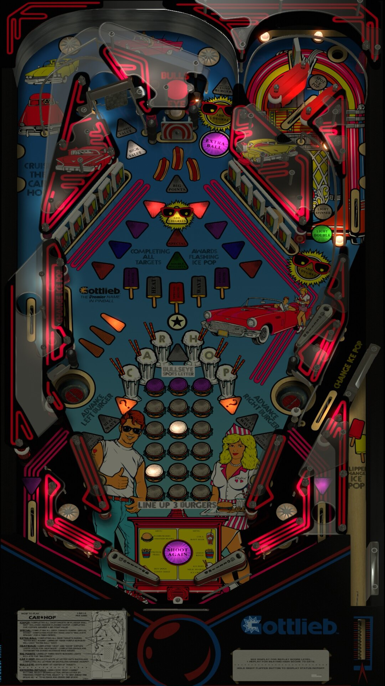

# Car Hop (Gottlieb 1991)

Tested by: Bla1ze

Author: [Goldchicco ](https://vpuniverse.com/profile/23579-goldchicco/)  
Version: 1.0b  
Download: [VP Universe](https://vpuniverse.com/files/file/7520-car-hop-gottlieb-1991/)

DirectB2S

Author: [wildman](https://vpuniverse.com/profile/5-wildman/)  
Version: 2.0  
Download: [VP Universe](https://vpuniverse.com/files/file/2332-car-hoppremier-1991/)

ROM (carhop)

Download: [Pinball Nirvana](https://pinballnirvana.com/forums/resources/carhop.1647/)

SHA: 33402818a89e5c2728a5278802757f7fefbe5a47  
MD5: f9c82529a12b3ce03cc81fed10e0f9ac

## Status 

Minimum VPX Standalone build: 10.8.0-1983-a764013

| Playfield | Controls | Backglass | DMD | ROM Required | FPS | 
|-----------|----------|-----------|-----|--------------|-----|
| :white_check_mark: | :white_check_mark: | :white_check_mark: | :x: | :white_check_mark: | 40 |

## Instructions

- Install this table through the Table Manager, using the `Add Table` > `Manual` page
- If you need help, more information found on the wiki: [TM - Add Table - Manual](https://github.com/LegendsUnchained/vpx-standalone-alp4k/wiki/%5B04%5D-%F0%9F%A7%A1-TM-%E2%80%90-Other-Features#add-table---manual)
- If the table requires any additional files/steps, click `GO TO TABLE` after adding, and the TM will open to the relevant table folder.
- Note: The audio on this game starts up scratchy, it goes away as soon as you start playing. It's just the ROM.
- Hop on over to the Car Hop! - 🚙

