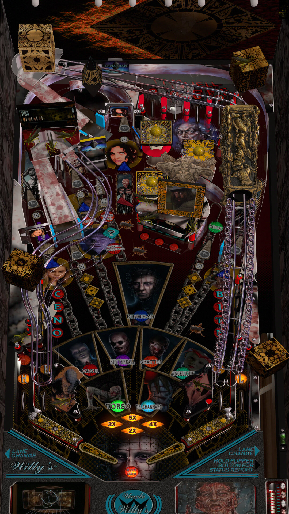

# Cenobite (Uncle Willy 2023)

Authors: [unclewilly](https://pinballnirvana.com/forums/members/unclewilly.738/)  
Version: 1.0.0  
Download: [VPUniverse](https://vpuniverse.com/files/file/16469-cenobite-uncle-willy-2023/)

DirectB2S

Authors: [hauntfreaks](https://vpuniverse.com/profile/5216-hauntfreaks/)  
Download: [VPUniverse](https://vpuniverse.com/files/file/16468-cenobite-uncle-willy-2023-b2s-with-full-dmd/)

ROM

None

Tested by: Bruno15477

## Status 

Minimum VPX Standalone build: 10.8.0-1989-a764013

| Playfield | Controls | Backglass | DMD | ROM Required | FPS | 
|-----------|----------|-----------|-----|--------------|-----|
| :white_check_mark: | :white_check_mark: | :white_check_mark: | :white_check_mark: | :x: | 60 |

## Instructions

- Copy the contents of this repo folder to your USB drive
- Add your personalized launcher.elf and rename it to vpx-cenobite.elf
- Download the table and directb2s listed above, extract (if necessary) and copy to external/vpx-cenobite
- Make sure (.vpx), (.directb2s), and (.ini) files are all named the same
