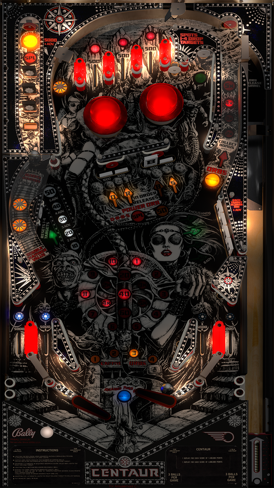

# Centaur (Bally 1981)

Author: [Bord](https://vpuniverse.com/profile/9265-bord/)  

Tested by: Bla1ze

Version: 1.1

Download: [VP Universe](https://vpuniverse.com/files/file/12948-centaur-bally-1981/)

DirectB2S

Author: [Manbearpig](https://vpuniverse.com/profile/32743-manbearpig/)

Version: 1

Download: [VP Universe](https://vpuniverse.com/files/file/11861-centaur-bally-1981-b2s-full-dmd-and-3-screen/) - Choose Centaur (Bally 1981) 3 screen.directb2s as it has the score on the backglass.

ROM

Download: [VP Forums](https://www.vpforums.org/index.php?app=downloads&showfile=658)

SHA: 280162d48b728f2c3a06854b09f919e5efdee966

MD5: a4dc0c753d1c1e5f6d573478a7d17cf2

## Status 

Minimum VPX Standalone build: 10.8.0-1989-a764013
| Playfield | Controls | Backglass | DMD | ROM Required | FPS | 
|-----------|----------|-----------|-----|--------------|-----|
| :white_check_mark: | :white_check_mark: | :white_check_mark: | :x: | :white_check_mark: | 40 |

## Instructions

- Copy the contents of this repo folder to your USB drive
- Add your personalized launcher.elf and rename it to vpx-centaur.elf
- Download the table, ROM and directb2s versions listed above and copy them into this folder
- Destroy Centaur!
