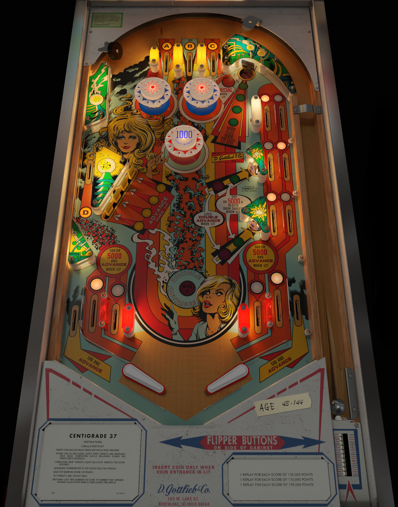

# Centigrade 37 (Gottlieb 1977)

Authors: [bord](https://vpuniverse.com/profile/9265-bord/)  
Version: 3.2  
Download: [VPUniverse](https://vpuniverse.com/files/file/7231-centigrade-37-gottlieb-1977/)

DirectB2S

Authors: [hauntfreaks](https://vpuniverse.com/profile/5216-hauntfreaks/)  
Download: [VPUniverse](https://vpuniverse.com/files/file/7234-centigrade-37-gottlieb-1977-b2s/)

ROM

None

Tested by: evilwraith

## Status 

Minimum VPX Standalone build: 10.8.0-1989-a764013

| Playfield | Controls | Backglass | DMD | ROM Required | FPS | 
|-----------|----------|-----------|-----|--------------|-----|
| :white_check_mark: | :white_check_mark: | :white_check_mark: | :x: | :x: | 43 |

## Instructions

- Copy the contents of this repo folder to your USB drive
- Add your personalized launcher.elf and rename it to vpx-centigrade37.elf
- Download the table and directb2s listed above, extract (if necessary) and copy to external/vpx-centigrade37
- Make sure (.vpx), (.directb2s), (.vbs) and (.ini) files are all named the same
