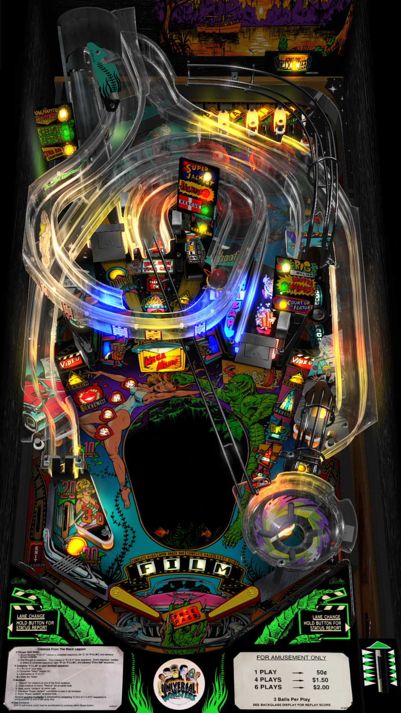

# Creature from the Black Lagoon (Bally 1992)

Authors: [fuzzel](https://www.vpforums.org/index.php?showuser=69907)
Version: 1.3
Download: [VP Forums](https://www.vpforums.org/index.php?app=downloads&showfile=13349)

DirectB2S

Authors: [hauntfreaks](https://vpuniverse.com/profile/5216-hauntfreaks/)
Version: 3.0
Download: [VP Universe](https://vpuniverse.com/files/file/12155-creature-from-the-black-lagoon-bally-1992-b2s-with-full-dmd/)

ROM

Download: [VP Forums](https://www.vpforums.org/index.php?app=downloads&showfile=1169)

Color DMD

Author: [ebor](https://vpuniverse.com/profile/29168-ebor/)
Download: [VP Universe](https://vpuniverse.com/files/file/20079-creature-from-the-black-lagoon-bally-1992-dmd-64-colors-serum-format/)
Place the .cRZ file "external\vpx-cftbl\pinmame\altcolor\cftbl_l4" (create the folders if needed)

## Status 

Minimum VPX Standalone build: 10.8.0-1989-a764013
| Playfield | Controls | Backglass | DMD | ROM Required | FPS | 
|-----------|----------|-----------|-----|--------------|-----|
| :white_check_mark: | :white_check_mark: | :white_check_mark: | :white_check_mark: | :white_check_mark: | 50 |

## Instructions

- Copy the contents of this repo folder to your USB drive
- Add your personalized launcher.elf and rename it to vpx-cftbl.elf
- Download the table and directb2s versions listed above and copy them into this folder
