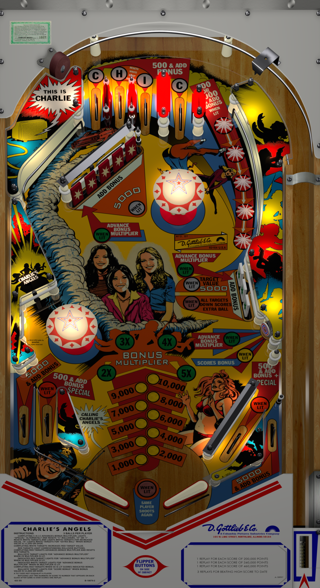

# Charlie's Angels (Gottlieb 1978) iDig Complete rEMix

Author(s): [iDigStuff](https://vpuniverse.com/profile/29753-idigstuff/)  
Version:  Charlies-Angels-Gottlieb-1978-iDig-Complete-rEMix.zip
Download:  [VPUniverse](https://vpuniverse.com/files/file/5943-charlie%e2%80%99s-angels-gottlieb-1978-idig-complete-remix/)

DirectB2S

Version: Charlie's Angels (Gottlieb 1978) iDig Complete rEMix.directb2s
directb2s file is included in the table zip.

Author(s): [iDigStuff](https://vpuniverse.com/profile/29753-idigstuff/) 

ROM: charlies.zip (Custom Created ROM) (Compatible with VpinMame beta 3.6 and newer.)
Charlie's Angels - ROM
Click "SHOW ALL" / Click "charlies.zip"

Author(s): [TechZombie]
Download:  [Internet Archive](https://archive.org/details/charlies_202408)

Tested by:
[TechZombie]

## Status 

Minimum VPX Standalone build: 10.8.0-1983-b84441e
| Playfield | Controls | Backglass | DMD | ROM Required | FPS | 
|-----------|----------|-----------|-----|--------------|-----|
| :white_check_mark: | :white_check_mark: | :white_check_mark: | :white_check_mark: | :white_check_mark: | 57 |

## Instructions

- Install this table through the Table Manager, using the `Add Table` > `Manual` page
- If you need help, more information found on the wiki: [TM - Add Table - Manual](https://github.com/LegendsUnchained/vpx-standalone-alp4k/wiki/%5B04%5D-%F0%9F%A7%A1-TM-%E2%80%90-Other-Features#add-table---manual)
- If the table requires any additional files/steps, click `GO TO TABLE` after adding, and the TM will open to the relevant table folder.
- Open Charlies-Angels-Gottlieb-1978-iDig-Complete-rEMix, Place Music Folder "Charlie" ---> vpx-charliesangelsremix\music\EM\.
- Go fire up your Vpin and enjoy!
- "Good Morning Vpins!" ---Charlie Townsend

