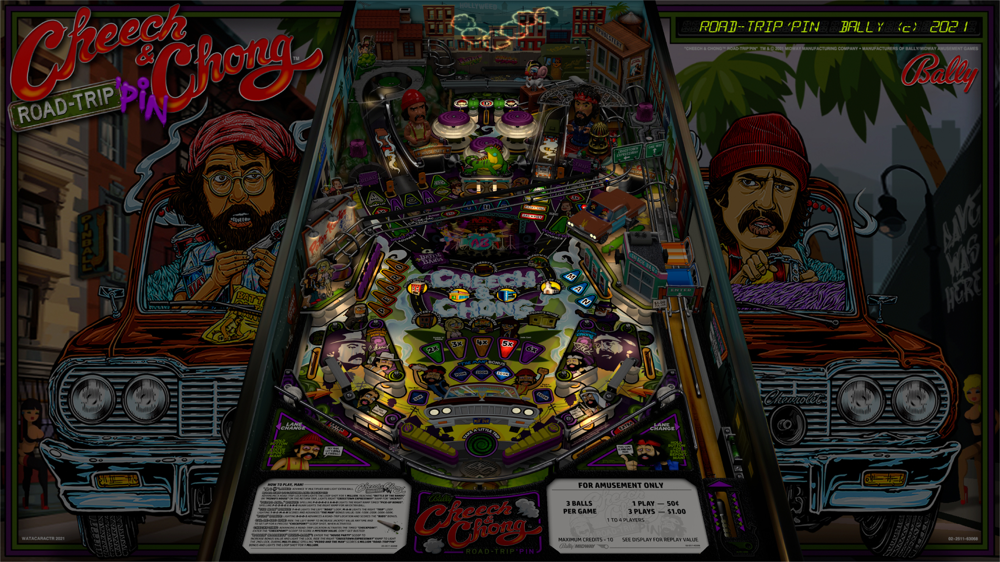

# Cheech & Chong: Road-Trip'pin (Bally 2021)

Author(s): [watacaractr](https://www.vpforums.org/index.php?showuser=89014)  
Version: 1.0  
Download: [VP Forums](https://www.vpforums.org/index.php?app=downloads&showfile=15975)

DirectB2S

Author(s): [watacaractr](https://www.vpforums.org/index.php?showuser=89014)  
Version: 1.0  
Download: [VP Forums](https://www.vpforums.org/index.php?app=downloads&showfile=15973)

ROM

Version: che_cho.zip  
Download: [VP Forums](https://www.vpforums.org/index.php?app=downloads&showfile=15971)

Alternate Soundtrack:  
Included in table zip.

## Status 

Minimum VPX Standalone build: 10.8.0-1983-b84441e

| Playfield | Controls | Backglass | DMD | ROM Required | FPS | 
|-----------|----------|-----------|-----|--------------|-----|
| :white_check_mark: | :white_check_mark: | :white_check_mark: | :white_check_mark: | :white_check_mark: | 45 |

## Instructions

- Install this table through the Table Manager, using the `Add Table` > `Manual` page
- If you need help, more infomation found on the wiki: [TM - Add Table - Manual](https://github.com/LegendsUnchained/vpx-standalone-alp4k/wiki/%5B04%5D-%F0%9F%A7%A1-TM-%E2%80%90-Other-Features#add-table---manual)
- If the table requires any additional files/steps, click `GO TO TABLE` after adding, and the TM will open to the relevant table folder.
- Open the table folder and place the folder che_cho in vpx-cheechandchong/pinmame/altsound
- Move the altsound.ini into the folder che_cho in vpx-cheechandchong/pinmame/altsound/che_cho
- A prompt will ask if you want to replace the existing file altsound.ini select yes and replace it.
- Chong: "You wanna get high man?"  Cheech: "Does Howdy Doody got wooden balls man?"

