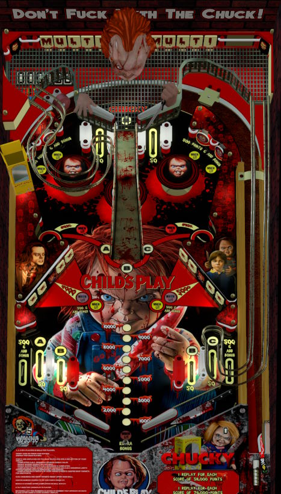

# Child's Play (Original 2018)

---

## Files
| File Type | Link | Version | Author | 
|-----------|--------|----------|--------------|
| **VPX** | [VPUniverse](https://vpuniverse.com/files/file/14246-childs-play-table-v10-puppack-10/) | 1.0 | [dgrace](https://vpuniverse.com/profile/24616-dgrace/) |
| **B2S** | N/A | N/A | N/A |
| **DMD** | N/A | N/A | N/A |
| **ROM** | N/A | N/A | N/A |

**Tested by:** [mrandromeda]

---

## Status 
**Minimum VPX Standalone build:** 10.8.0-5b941e6
| Playfield | Controls | Backglass | DMD | ROM Required | FPS | 
|-----------|----------|-----------|-----|--------------|-----|
| :white_check_mark: | :white_check_mark: | :white_check_mark: | :x: | :x: | 50 |

---

## Instructions

- Copy the contents of this repo folder to your USB drive
- Add your personalized launcher.elf and rename it to `vpx-childsplay.elf`
- Download the table with pup file `Child's Play.zip` version listed above.
- Extract from the zip the table `Childs Play (Original 2018) Joe Picasso.vpx` and copy it into `vpx-childsplay`
- Make sure `(.vpx)` `(.vbs)` and `(.ini)` are all named the same.
- Create the folder `pupvideos`.
- Extract from the zip the folder `PupPack/Fast_Draw_1975` and place this folder in `pupvideos`.
- Unzip the `use_these_pup_files.zip` and place them inside the `pupvideos/Fast_Draw_1975` folder, and overwrite files if prompted.
- "I'm your friend to the end" - Chucky

