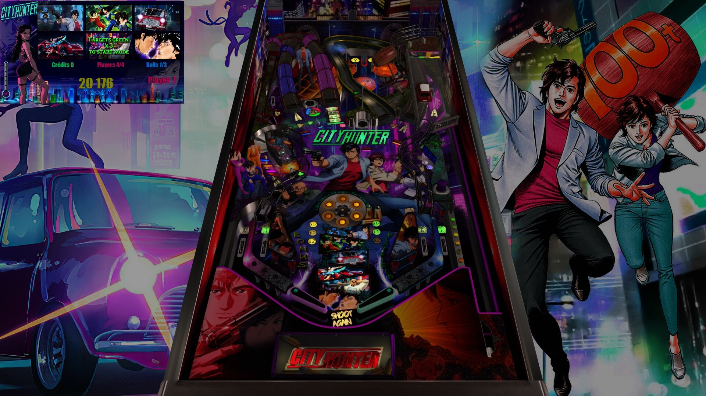

# City Hunter (Original 2025)

---

## Files
| File Type | Link | Version | Author | 
|-----------|--------|----------|--------------|
| **VPX** | [VPUniverse](https://vpuniverse.com/files/file/26187-city-hunter-original-2025/) |
| **PUP** | [VPUniverse](https://vpuniverse.com/files/file/26187-city-hunter-original-2025/) |
| **ROM** | none |  |  |

## Status 

Minimum VPX Standalone build: 10.8.0-1989-a764013

| Playfield | Controls | Backglass | DMD | ROM Required | FPS | 
|-----------|----------|-----------|-----|--------------|-----|
| :white_check_mark: | :x: | :x: | :x: | :x: | 45 |

**Tested by:** [Silentkat]

---

 

---

 

## ❇️ Available in the Wizard! 🪄✨

 

This table is available through the Table Manager Wizard, which makes installation quick and easy!

### How to install:

1.  Open the **Table Manager**
2.  Click the **Add Table** button
3.  Select the **Wizard** tab
4.  Find and select this table from the dropdown menu: **`Trailer Park Boys - Pin-Ballers (Original 2024)`**
5.  Follow the on-screen instructions to download and upload the required files
6. *"What comes around is all around"*

 

Using the Wizard ensures you get the latest table version, have all required files (ROM, backglass, etc.), and have all the VPXS 4KP team's table tweaks and improvements!

 

__*We hope you enjoy!!*__

*The VPXS 4KP Wizard team:*
<pre>
- n-i-x            - Mox              - Lloydbraun
- Boris Undead     - 'Coffee' Joe     - Ominous Osie 🌸
- Bla1ze           - evilwraith       - Silentkat        
- mrandromeda      - SScorpio         - pointdablame
</pre>

 
 
 
 
 
