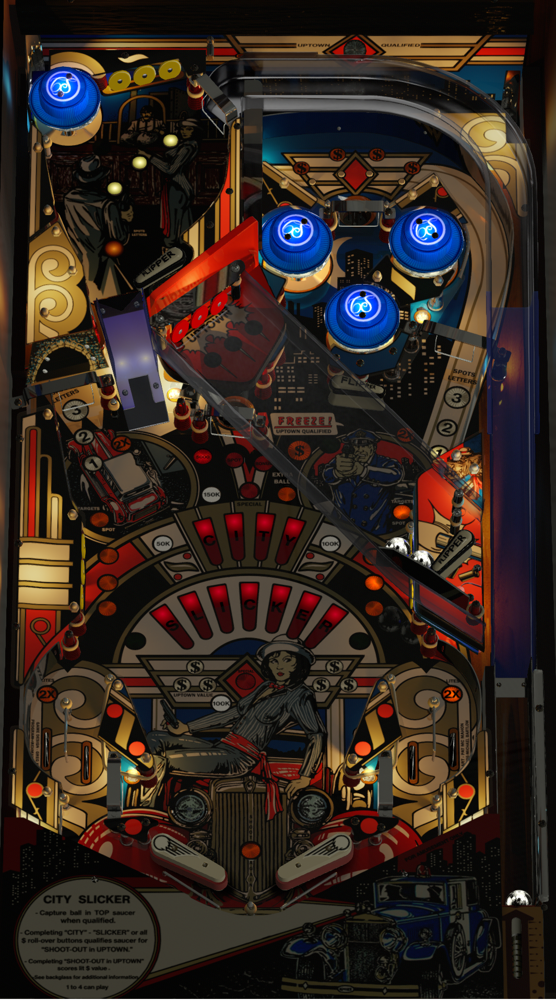

# City Slicker (Bally 1987)

Authors: [mistermixer](https://www.vpforums.org/index.php?showuser=21898)  
Version: 1.0  
Download: [VPForums](https://www.vpforums.org/index.php?app=downloads&showfile=15498)

DirectB2S

Authors: [dboyrecords](https://www.vpforums.org/index.php?showuser=59710)  
Download: [VPForums](https://www.vpforums.org/index.php?app=downloads&showfile=8906)

ROM

ROM Name: cityslck.zip  
Download: [VPForums](https://www.vpforums.org/index.php?app=downloads&showfile=208)  

SHA1: FC00A3F8A8EF894C9CBD4482274DC29693B0D377  
MD5:  530059666882FF4219846E21983C6224 

Tested by: evilwraith

## Status 

Minimum VPX Standalone build: 10.8.0-1989-a764013
| Playfield | Controls | Backglass | DMD | ROM Required | FPS | 
|-----------|----------|-----------|-----|--------------|-----|
| :white_check_mark: | :white_check_mark: | :white_check_mark: | :x: | :white_check_mark: | 32 |

## Instructions

- Copy the contents of this repo folder to your USB drive
- Add your personalized launcher.elf and rename it to vpx-cityslicker.elf
- Download the table and directb2s listed above, extract (if necessary) and copy to external/vpx-cityslicker
- Make sure (.vpx), (.directb2s), (.vbs) and (.ini) files are all named the same
- The ROM zip file gets copied to vpx-cityslicker/pinmame/roms (Do not unzip)
