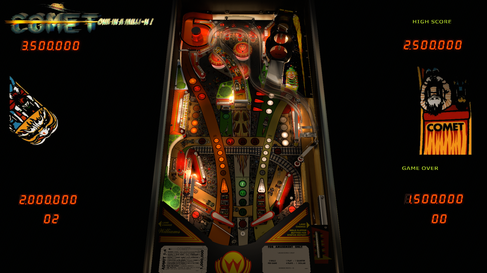

# Comet (Williams 1985)

Authors: [UnclePaulie](https://vpuniverse.com/profile/16685-unclepaulie/)
Version: 2.3
Download: [VPUniverse](https://vpuniverse.com/files/file/8673-comet-williams-1985-w-vr-room/)

DirectB2S

Authors: [hauntfreaks](https://vpuniverse.com/profile/5216-hauntfreaks/)
Version: 1.0.0
Download: [VP Universe](https://vpuniverse.com/files/file/10981-comet-williams-1985-b2s-with-full-dmd/)

ROM

Download: [vpforums](https://www.vpforums.org/index.php?app=downloads&showfile=891)
Rom Name and Version: comet_l5.zip

## Status 

Minimum VPX Standalone build: 10.8.0-1989-a764013
| Playfield | Controls | Backglass | DMD | ROM Required | FPS | 
|-----------|----------|-----------|-----|--------------|-----|
| :white_check_mark: | :white_check_mark: | :white_check_mark: | :white_check_mark: | :white_check_mark: | 34 |

## Instructions

- Install this table through the Table Manager, using the `Add Table` > `Manual` page
- If you need help, more infomation found on the wiki: [TM - Add Table - Manual](https://github.com/LegendsUnchained/vpx-standalone-alp4k/wiki/%5B04%5D-%F0%9F%A7%A1-TM-%E2%80%90-Other-Features#add-table---manual)
- If the table requires any additional files/steps, click `GO TO TABLE` after adding, and the TM will open to the relevant table folder.
- "An unforgettable ride, as fast as a comet in space!"

