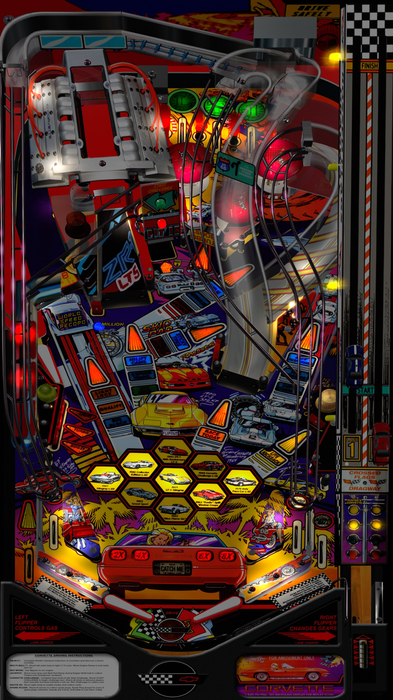

# Corvette (Midway 1994)  

Author: [goldchicco](https://www.vpforums.org/index.php?showuser=88795)  
Version: 1.4.2  
Download: [VP Forums](https://www.vpforums.org/index.php?app=downloads&showfile=15112)

DirectB2S

Author: [Hauntfreaks](https://vpuniverse.com/profile/5216-hauntfreaks/)  
Version: 1.0.0  
Download: [VP Universe](https://vpuniverse.com/files/file/21285-corvette-midway-1994-b2s-full-dmd/)

ROM (corv_21)

Download: [VP Forums](https://www.vpforums.org/index.php?app=downloads&showfile=1260)

SHA: 548455d48405eac96ef7a4ef2313193779b5dfa7  
MD5: 0b9398646df77a96828fb510d9802050

Tested by: Bla1ze

## Status 

Minimum VPX Standalone build: 10.8.0-1983-a764013

| Playfield | Controls | Backglass | DMD | ROM Required | FPS | 
|-----------|----------|-----------|-----|--------------|-----|
| :white_check_mark: | :white_check_mark: | :white_check_mark: | :white_check_mark: | :white_check_mark: | 45 |

## Instructions

- Make sure to use the Table Manager to install this table.
- Instructions can be found on the wiki [Add Table - Manual](https://github.com/LegendsUnchained/vpx-standalone-alp4k/wiki/%5B04%5D-%F0%9F%A7%A1-TM-%E2%80%90-Other-Features#add-table---manual)
- If the table requires any additional files/steps, click `GO TO TABLE` after adding, and the TM will open to the relevant table folder.
- You don't take this CORVETTE for a spin. It takes you. 🚘

