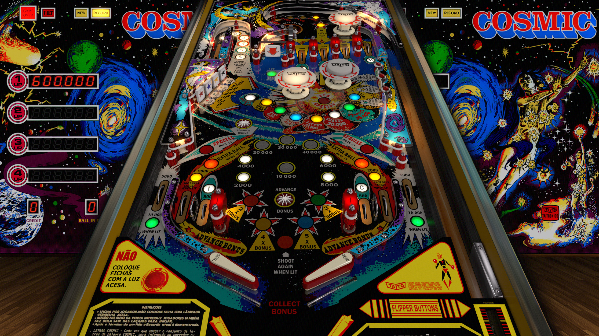

# Cosmic (Taito do Brasil 1980)

Table

Authors: [JPSalas](https://www.vpforums.org/index.php?showuser=277)  
Version: 5.5.0  
Download: [VP Forums](https://www.vpforums.org/index.php?s=81e3316e17b8e2a79c701d961fdf74f4&app=downloads&showfile=13494)

DirectB2S

Authors: [Wildman](https://vpuniverse.com/profile/5-wildman/)  
Version: 1.0.0
Download: [VP Universe](https://vpuniverse.com/files/file/5119-cosmic-taito-1980/)

ROM

Authors: [destruk](https://www.vpforums.org/index.php?showuser=5)
Download: [VP Forums](https://www.vpforums.org/index.php?app=downloads&showfile=564)

Tested by: Boris

## Status 

Minimum VPX Standalone build: 10.8.0-1989-a764013

| Playfield | Controls | Backglass | DMD | ROM Required | FPS | 
|-----------|----------|-----------|-----|--------------|-----|
| :white_check_mark: | :white_check_mark: | :white_check_mark: | :x: | :white_check_mark: | 60 |

## Instructions

- Copy this repo folder into the "external" folder on your USB drive
- Add your personalized launcher.elf and rename it to vpx-cosmic.elf
- Download the table and directb2s versions listed above, extract them (if necessary) and copy them to external/vpx-cosmic
- Make sure any (.vpx), (.directb2s), (.vbs), and (.ini) files are all named the same
- Download the ROM listed above and place it in vpx-cosmic/pinmame/roms. Do not unzip!
- "There is stardust in your veins. We are literally, ultimately children of the stars." -Jocelyn Bell Burnell
