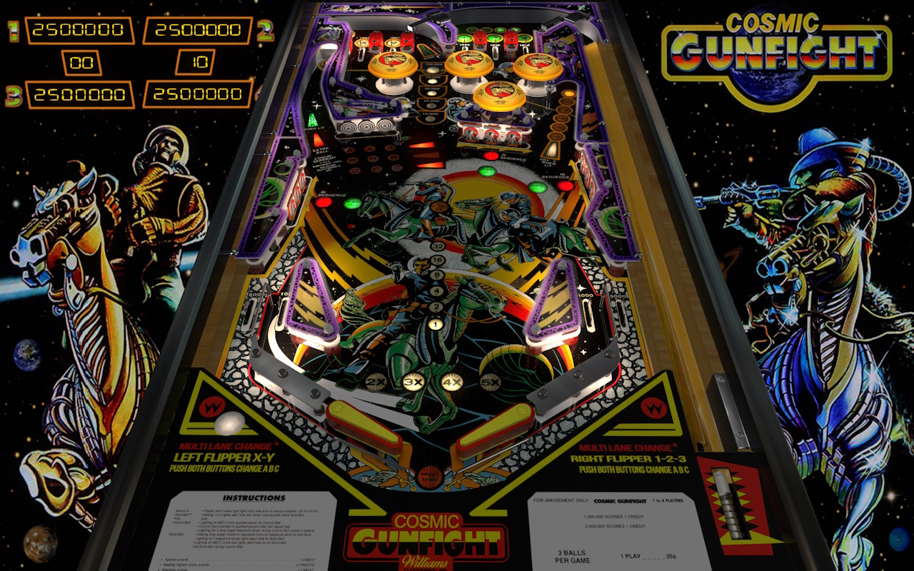

# Cosmic Gunfight (Williams 1982)

Tested by: kaoticBPR

Authors: [bigus1](https://www.vpforums.org/index.php?s=6fc5c7c72f7465f3ef77b0c3bce8706f&showuser=107629)  
Version: 1.0  
Download: [VPForums](https://www.vpforums.org/index.php?app=downloads&showfile=16798)

DirectB2S

Authors: [herwah](https://vpuniverse.com/profile/36-herweh/)  
Version: v1.0  
Download: [VPUniverse](https://vpuniverse.com/files/file/2045-cosmic-gunfight-williams-1982-db2s/)

ROM

Download: [vpforums](http://www.vpforums.org/index.php?app=downloads&showfile=796)  
ROM Name and version: csmic_l1

## Status 

Minimum VPX Standalone build: 10.8.0-1989-a764013

| Playfield | Controls | Backglass | DMD | ROM Required | FPS | 
|-----------|----------|-----------|-----|--------------|-----|
| :white_check_mark: | :white_check_mark: | :white_check_mark: | :x: | :white_check_mark: | 60 |

## Instructions

- Copy the contents of this repo folder to your USB drive
- Add your personalized launcher.elf and rename it to vpx-cosmicgunfight.elf
- Download the table and directb2s versions listed above, extract them and copy them to /external/vpx-cosmicgunfight
- Make sure (.vpx), (.directb2s), and (.ini) files are all named the same
- Place csmic_l1.zip in the external/vpx-cosmicgunfight/pinmame/roms folder. *Do Not unzip*!
- "Nothing like a good gunfight, in space."

