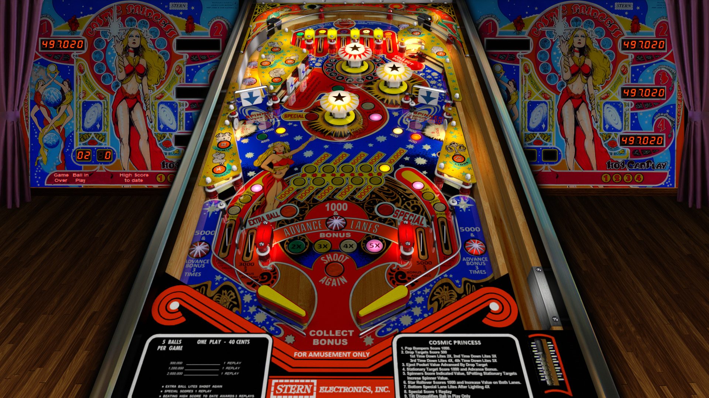

# Cosmic Princess (Stern 1979)

Author: [jpsalas](https://www.vpforums.org/index.php?showuser=277)  
Version: 5.5.1  
Cosmic Princess (Stern - 1979) v55_VPX8.zip  
Download: [VP Forums](https://www.vpforums.org/index.php?app=downloads&showfile=14219)

DirectB2S
Author: [Wildman](https://vpuniverse.com/profile/5-wildman/)  
Cosmic Princess (Stern 1979).directb2s  
Download: [VP Universe](https://vpuniverse.com/files/file/2219-cosmic-princessstern-1979/)  

ROM  
Download: [vpforums](https://www.vpforums.org/index.php?app=downloads&showfile=736)  
ROM Name and version: princess.zip  
  
Tested by:  
[psybocilin]

## Status 

Minimum VPX Standalone build: 10.8.0-1989-a764013

| Playfield | Controls | Backglass | DMD | ROM Required | FPS | 
|-----------|----------|-----------|-----|--------------|-----|
| :white_check_mark: | :white_check_mark: | :white_check_mark: | :x: | :white_check_mark: | 60 |

## Instructions

- Install this table through the Table Manager, using the `Add Table` > `Manual` page
- If you need help, more infomation found on the wiki: [TM - Add Table - Manual](https://github.com/LegendsUnchained/vpx-standalone-alp4k/wiki/%5B04%5D-%F0%9F%A7%A1-TM-%E2%80%90-Other-Features#add-table---manual)
- If the table requires any additional files/steps, click `GO TO TABLE` after adding, and the TM will open to the relevant table folder.
- Download the table and Media pack zips above, extract (if necessary) and copy into /external/vpx-cosmicprincess
- "A Galaxy Full of Entertainment!"

