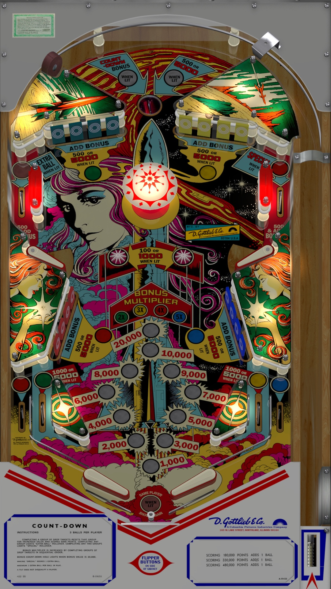

# Count-Down (Gottlieb 1979)

Authors: [JPSalas](https://www.vpforums.org/index.php?showuser=277)  
Version: 5.5.0  
Download: [VP Universe](https://www.vpforums.org/index.php?app=downloads&showfile=13519)

DirectB2S

Authors: [ryguy417](https://vpuniverse.com/profile/31096-ryguy417/)  
Version 1.0.1  
Download: [VP Universe](https://vpuniverse.com/files/file/13505-count-down-gottlieb-1979/)

ROM

Download: [Pinball Nirvana](https://pinballnirvana.com/forums/resources/new-fixed-roms-for-vpinmame-v3-6-0-963-beta.8379/)

Tested by: Boris

## Status 

Minimum VPX Standalone build: 10.8.0-1989-a764013

| Playfield | Controls | Backglass | DMD | ROM Required | FPS | 
|-----------|----------|-----------|-----|--------------|-----|
| :white_check_mark: | :white_check_mark: | :white_check_mark: | :x: | :white_check_mark: | 60 |

## Instructions

- Download and extract the ROMs folder listed above, and copy countdwn.zip into vpx-countdownjp/pinmame/roms. Do no unzip!
- 3... 2... 1... Blast off!
