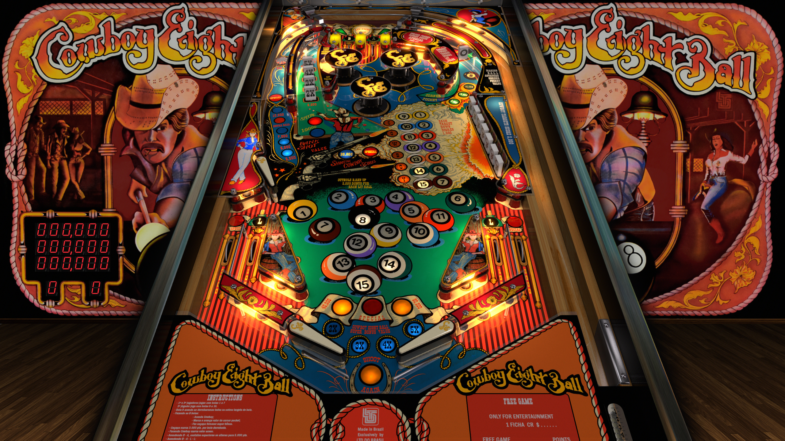

# Cowboy Eight Ball (LTD do Brasil 1981)

---

## Files
| File Type | Link | Version | Author | 
|-----------|--------|----------|--------------|
| **VPX** | [VPForums](https://www.vpforums.org/index.php?app=downloads&showfile=15012) | 5.5.0 | [jpsalas](https://www.vpforums.org/index.php?showuser=277) |
| **B2S** | `Cowboy Eight Ball.directb2s.zip` Included in VPX link |
| **ROM** | `cowboy3p.zip` Included in VPX link |

**Tested by:** [Curt](https://github.com/Old-Cyrus)

---

## Status 
**Minimum VPX Standalone build:** 10.8.0-1989-a764013

| Playfield | Controls | Backglass | DMD | ROM Required | FPS | 
|-----------|----------|-----------|-----|--------------|-----|
| :white_check_mark: | :white_check_mark: | :white_check_mark: | :x: | :white_check_mark: | 60 |

---

## Instructions

