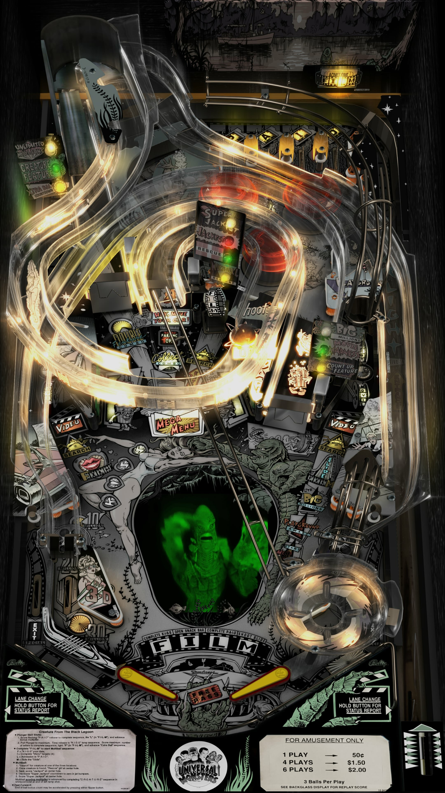

# Creature From The Black Lagoon (1992) - BW Edition

Author(s): [SG1bsoN](https://vpuniverse.com/profile/34010-sg1bson/)  
Version: 4.3.0 
Download: [VP Universe](https://vpuniverse.com/files/file/6978-creature-from-the-black-lagoon-bally-1992-sg1bson-bw-mod/)

DirectB2S

DirectB2S file is included in the table zip.

ROM:
Version (L-4)
Download: [VP Forums](https://www.vpforums.org/index.php?app=downloads&showfile=1169)

Alternate Soundtrack:
I highly recommend this file as it improves the overall experience of the table. (This file is not required for table to run)
Author(s): [iDigStuff](https://vpuniverse.com/profile/29753-idigstuff/)  
Version: Altsound 2.0.0
Download: [VP Universe](https://vpuniverse.com/files/file/5936-altsound-20-creature-from-the-black-lagoon-bally-1992/)
## Status 

Minimum VPX Standalone build: 10.8.0-1983-b84441e
| Playfield | Controls | Backglass | DMD | ROM Required | FPS | 
|-----------|----------|-----------|-----|--------------|-----|
| :white_check_mark: | :white_check_mark: | :white_check_mark: | :white_check_mark: | :white_check_mark: | 40 |

## Instructions

- Unzip Altsound 2.0, open unzipped folder and place the folder cftbl_l4 in vpx-creaturebw/pimame/altsound
- "Of all the lagoons, in all the world, she came into mine."

