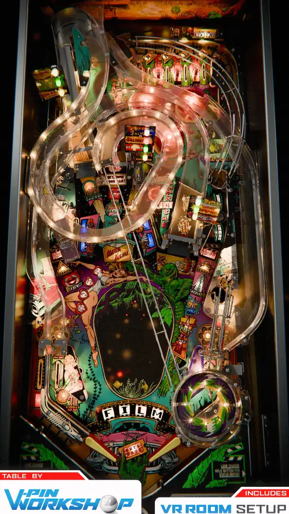

# Creature From the Black Lagoon (Bally 1992) Vpin Workshop Edition (Bally 1992)

---

## Files
| File Type | Link | Version | Author(s) | 
|-----------|--------|----------|--------------|
| **VPX** | [vpuniverse](https://vpuniverse.com/files/file/25612-creature-from-the-black-lagoon-williams-1992/) | 1.2 | VPW, Niwak, Sixtoe |
| **B2S** | download and use the included backglass.png |
| **ROM** | [vpforums](https://www.vpforums.org/index.php?app=downloads&showfile=1169) | cftbl_l4 | Destruk |

**Tested by:** Curt

---

## Status 

| Backglass | DMD | ROM Required | Has Puppack | FPS |
|-----------|-----|-----|-----|-----|
| ❌ | ✅ | ✅ | ❌ | 57 |

---

## Instructions

- Install this table through the Table Manager, using the `Add Table` > `Manual` page
- If you need help, more information can be found on the wiki: [TM - Add Table - Manual](https://github.com/LegendsUnchained/vpx-standalone-alp4k/wiki/%5B04%5D-%F0%9F%A7%A1-TM-%E2%80%90-Other-Features#add-table---manual)
- If the table requires any additional files/steps, click `GO TO TABLE` after adding, and the TM will open to the relevant table folder.
- 'Move your car!'
