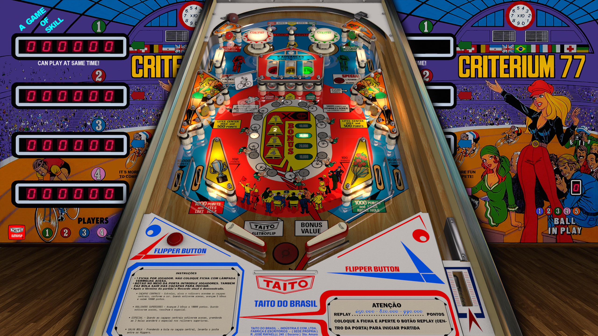

# Criterium 77 (Taito do Brasil 1977)

Table

Authors: [JPSalas](https://www.vpforums.org/index.php?showuser=277)  
Version: 5.5.0  
Download: [VP Forums](https://www.vpforums.org/index.php?app=downloads&showfile=14214)

DirectB2S

Authors: [JPSalas](https://www.vpforums.org/index.php?showuser=277)  
Version: 5.5.0  
Download: [VP Forums](https://www.vpforums.org/index.php?app=downloads&showfile=14214)

Tested by: Boris

## Status 

Minimum VPX Standalone build: 10.8.0-1989-a764013

| Playfield | Controls | Backglass | DMD | ROM Required | FPS | 
|-----------|----------|-----------|-----|--------------|-----|
| :white_check_mark: | :white_check_mark: | :white_check_mark: | :x: | :x: | 60 |

## Instructions

- "The bicycle is the noblest invention of mankind." – William Saroyan
