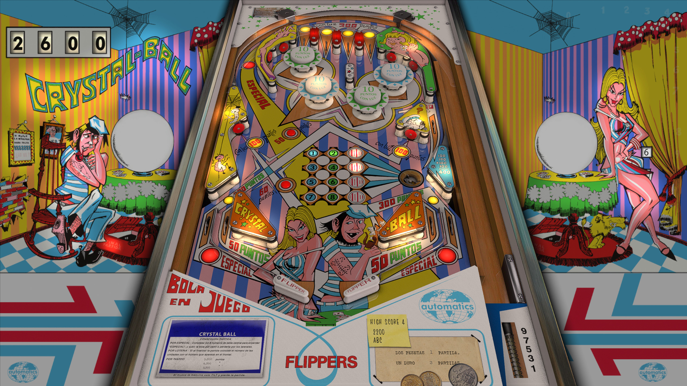

# Crystal-Ball (Talleres del Llobregat 1970)

---

## Files
| File Type | Link | Version | Author(s) | 
|-----------|--------|----------|--------------|
| **VPX** | [vpuniverse](https://vpuniverse.com/files/file/20408-crystal-ball-talleres-del-llobregat-1970-jp-vpx8-vr-mr-ext2k/) | 1.0.0 | Ext2k, JPSalas |
| **B2S** | [vpuniverse](https://vpuniverse.com/files/file/20408-crystal-ball-talleres-del-llobregat-1970-jp-vpx8-vr-mr-ext2k/) | 1.0.0 | Ext2k, JPSalas |
| **ROM** | [N/A](#) | N/A | N/A |
| **SERUM** | [N/A](#) | N/A | N/A |
| **PUPPACK** | [N/A](#) | N/A | N/A |

**Tested by:** Curt

---

## Status 

| Backglass | DMD | ROM Required | Has Puppack | FPS |
|-----------|-----|-----|-----|-----|
| ✅ | ❌ | ❌ | ❌ | 60 |

---

## Instructions

- Install this table through the Table Manager, using the `Add Table` > `Manual` page
- If you need help, more infomation found on the wiki: [TM - Add Table - Manual](https://github.com/LegendsUnchained/vpx-standalone-alp4k/wiki/%5B04%5D-%F0%9F%A7%A1-TM-%E2%80%90-Other-Features#add-table---manual)
- If the table requires any additional files/steps, click `GO TO TABLE` after adding, and the TM will open to the relevant table folder.
- ¡Final Partida!
