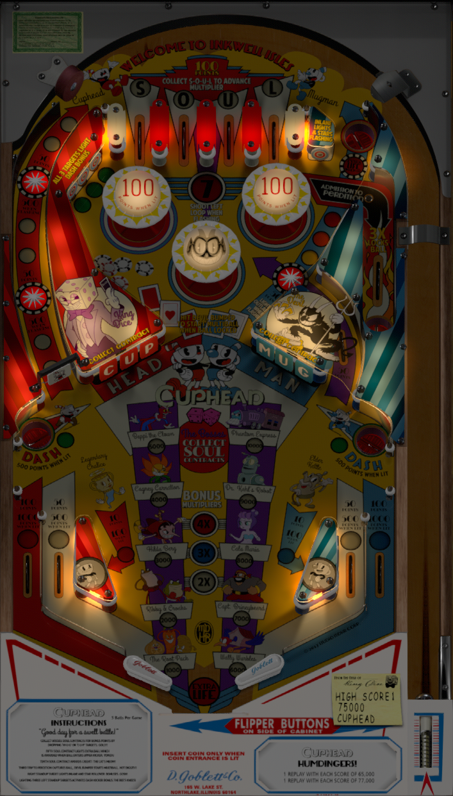

# Cuphead Pro (Original 2020)

Author: [Onevox](https://vpuniverse.com/profile/14340-onevox/)  
Version: 1.0.0  
Cuphead Pro (D. Goblett & Co 2020).vpx  
Download: [VPUniverse](https://vpuniverse.com/files/file/6145-cuphead-pro-perdition-edition-dgoblett-co-2020/)

DirectB2S
Author: [Onevox](https://vpuniverse.com/profile/14340-onevox/)  
Backglass Included with Table above  
Cuphead Pro (D. Goblett & Co 2020).directb2s  

MUSIC  
[uploadnow.io](https://uploadnow.io/s/45a7100f-273b-403f-8a4e-389b15197a61)  
Music.zip 
  
Tested by:  
[psybocilin]

## Status 

Minimum VPX Standalone build: 10.8.0-1989-a764013

| Playfield | Controls | Backglass | DMD | ROM Required | FPS | 
|-----------|----------|-----------|-----|--------------|-----|
| :white_check_mark: | :white_check_mark: | :white_check_mark: | :x: | :x: | 34 |

## Instructions

- Copy the contents of this repo folder to your USB drive
- Add your personalized launcher.elf and rename it to vpx-cuphead.elf
- Download the table and Media pack zips above, extract (if necessary) and copy into /external/vpx-cuphead 
- Make sure (.vpx), (.directb2s), and (.ini) files are all named the same
- Unzip Music.zip and place folder "Music" in vpx-cuphead
- "Stupid Cup, Making Me Go Around The Back. I'm The Devil. Nobody Tells Me What To Do."
