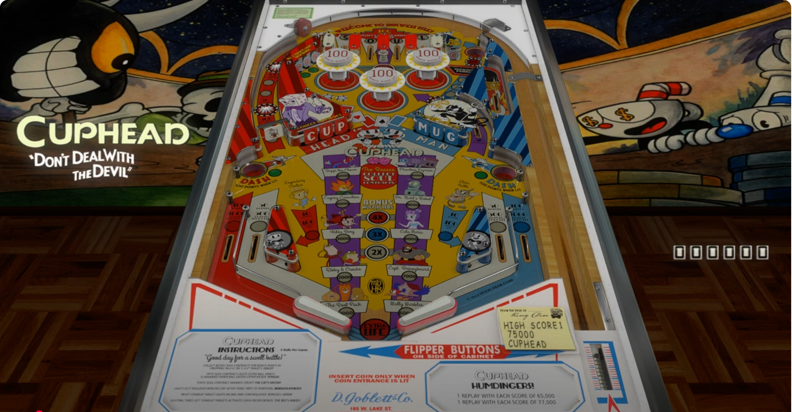

# Cuphead Original  (D.Goblett & Co 2019)

---

## Files
| File Type | Link | Version | Author | 
|-----------|--------|----------|--------------|
| **VPX** | [Archive.org](https://ia903203.us.archive.org/view_archive.php?archive=/17/items/Visual_Pinball_2020-06-20/Visual%20Pinball%20%5BVPXx%5D%20Original%20Tables/Cuphead%20%28D.Goblett%20%26%20Co%202019%29%28Onevox%29%284.0b%29%5BVPX06%5D%5BDT%2BFS%2BdB2S%2BDOF%5D.zip) | 4.0b | [Onevox]({https://vpuniverse.com/profile/14340-onevox/)|
| **B2S** | Backglass Included with Table | 3.0 | [
Onevox]({https://vpuniverse.com/profile/14340-onevox/)|
| **DMD** | [{website}]({link}) | {version} | [{author}]({link}) | **ROM** | None | None | None |
|

**Tested by:** [Curt]

---

## Status 
**Minimum VPX Standalone build:** 10.8.0-1989-a764013

| Playfield | Controls | Backglass | DMD | ROM Required | FPS | 
|-----------|----------|-----------|-----|--------------|-----|
| :white_check_mark: | :white_check_mark: | :white_check_mark: | :x: | :x: | 47 |

---

## Instructions

- Copy the contents of this repo folder to your USB drive
- Add your personalized launcher.elf and rename it to `vpx-cupheado.elf`
- Download the table and directb2s versions listed above, extract (if necessary) and copy them into `vpx-cupheado`
- Rom file (FILENAME.zip) stays in zip folder, place zip file in `vpx-{tablename}/pinmame/roms`
- Make sure `(.vpx)` `(.direct2b2s)` `(.vbs)` and `(.ini)` are all named the same.
