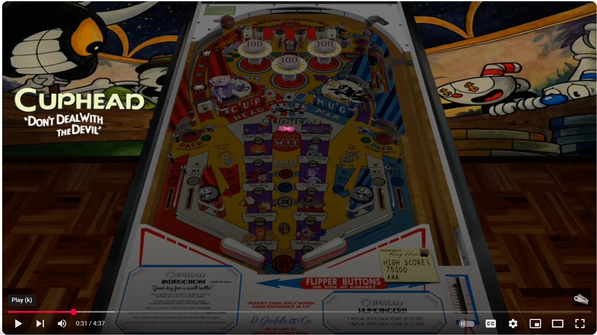

# Cuphead Original  (D.Goblett & Co 2019)

---

## Files
| File Type | Link | Version | Author | 
|-----------|--------|----------|--------------|
| **VPX** | [Archive.org](https://ia903203.us.archive.org/view_archive.php?archive=/17/items/Visual_Pinball_2020-06-20/Visual%20Pinball%20%5BVPXx%5D%20Original%20Tables/Cuphead%20%28D.Goblett%20%26%20Co%202019%29%28Onevox%29%284.0b%29%5BVPX06%5D%5BDT%2BFS%2BdB2S%2BDOF%5D.zip) | V4b | [Onevox](https://vpuniverse.com/profile/14340-onevox/)|
| **B2S** | [Archive.org](https://ia903203.us.archive.org/view_archive.php?archive=/17/items/Visual_Pinball_2020-06-20/Visual%20Pinball%20%5BVPXx%5D%20Original%20Tables/Cuphead%20%28D.Goblett%20%26%20Co%202019%29%28Onevox%29%284.0b%29%5BVPX06%5D%5BDT%2BFS%2BdB2S%2BDOF%5D.zip) | V4 | [Onevox](https://vpuniverse.com/profile/14340-onevox/)|
| **DMD** | DMD Included with Table | N/A | [Onevox]({https://vpuniverse.com/profile/14340-onevox/) |
| **ROM** | None | None | None |

**Tested by:** [Curt](https://github.com/Old-Cyrus)

---

## Status 
**Minimum VPX Standalone build:** 10.8.0-1989-a764013

| Playfield | Controls | Backglass | DMD | ROM Required | FPS | 
|-----------|----------|-----------|-----|--------------|-----|
| :white_check_mark: | :white_check_mark: | :white_check_mark: | :white_check_mark: | :x: | 47 (without music)|

---

## Instructions

- Install this table through the Table Manager, using the `Add Table` > `Manual` page
- If you need help, more infomation found on the wiki: [TM - Add Table - Manual](https://github.com/LegendsUnchained/vpx-standalone-alp4k/wiki/%5B04%5D-%F0%9F%A7%A1-TM-%E2%80%90-Other-Features#add-table---manual)
- If the table requires any additional files/steps, click `GO TO TABLE` after adding, and the TM will open to the relevant table folder.

