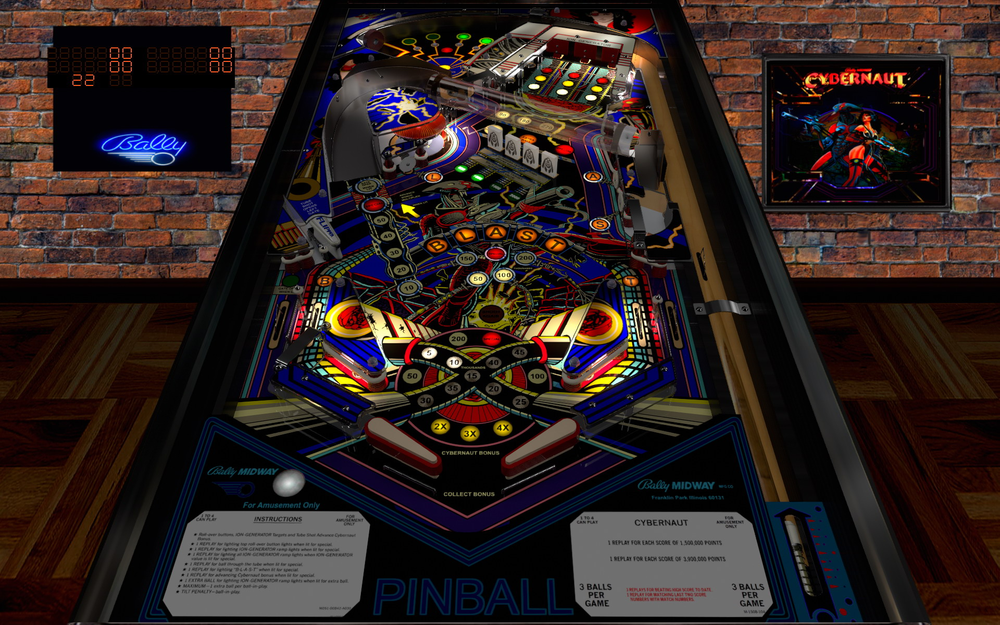

# Cybernaut (Bally 1985)

Table

Authors: [mistermixer](https://www.vpforums.org/index.php?showuser=21898), [Schlabber34](https://vpuniverse.com/profile/11680-schlabber34/), [bigus1](https://www.vpforums.org/index.php?showuser=107629)  
Version: 1.0  
Download: [VP Forums](https://www.vpforums.org/index.php?app=downloads&showfile=18843)

DirectB2S

Authors: [Wildman](https://www.vpforums.org/index.php?showuser=277)  
Version: 3.0  
Download: [VP Universe](https://vpuniverse.com/files/file/2278-cybernautbally-1985/)

ROM

Authors: [destruk](https://www.vpforums.org/index.php?showuser=5)  
Download: [VP Forums](https://www.vpforums.org/index.php?app=downloads&showfile=206)

Tested by: Boris

## Status 

Minimum VPX Standalone build: 10.8.0-1989-a764013

| Playfield | Controls | Backglass | DMD | ROM Required | FPS | 
|-----------|----------|-----------|-----|--------------|-----|
| :white_check_mark: | :white_check_mark: | :white_check_mark: | :x: | :white_check_mark: | 45 |

## Instructions

- Install this table through the Table Manager, using the `Add Table` > `Manual` page
- If you need help, more infomation found on the wiki: [TM - Add Table - Manual](https://github.com/LegendsUnchained/vpx-standalone-alp4k/wiki/%5B04%5D-%F0%9F%A7%A1-TM-%E2%80%90-Other-Features#add-table---manual)
- If the table requires any additional files/steps, click `GO TO TABLE` after adding, and the TM will open to the relevant table folder.
- "Conquer the future of pinall!" -Cybernaut promotional flier

