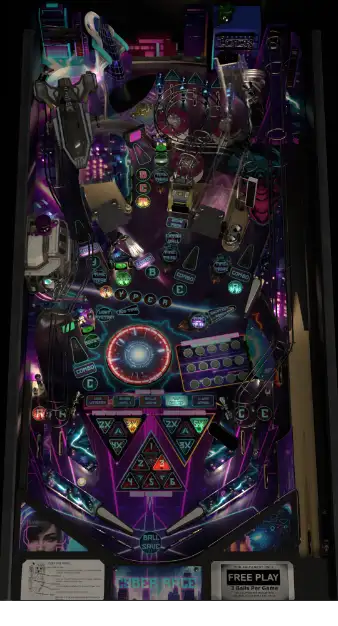

# Cyber Race (Original 2023)

---

## Files
| File Type | Link | Version | Author(s) | 
|-----------|--------|----------|--------------|
| **VPX** | [vpuniverse](https://vpuniverse.com/files/file/17837-cyberrace-flux-original-2023/) | 1.3.8 | Flux, Karl Casey, Sixtoe |
| **B2S** | [vpuniverse](https://vpuniverse.com/files/file/17823-cyberrace-original-2023-b2s/) | 1.0.0 |  |

**Tested by:** Curt

---

## Status 

| Backglass | DMD | ROM Required | Has Puppack | FPS |
|-----------|-----|-----|-----|-----|
| ✅ | ✅ | ❌ | ❌ | 40 |

---

## Instructions

- Install this table through the Table Manager, using the `Add Table` > `Manual` page
- If you need help, more information can be found on the wiki: [TM - Add Table - Manual](https://github.com/LegendsUnchained/vpx-standalone-alp4k/wiki/%5B04%5D-%F0%9F%A7%A1-TM-%E2%80%90-Other-Features#add-table---manual)
- Click `GO TO TABLE` after adding, and the TM will open to the relevant table folder.
- BASS Fix requires approximately 40 minutes. Be patient!
- Copy 'Music' and 'CyberRaceDMD' folders from the table download folder to vpx-cyberrace on your drive
- 'Choose your race rival' --if plunger does not activate, use Joypad/stick UP
