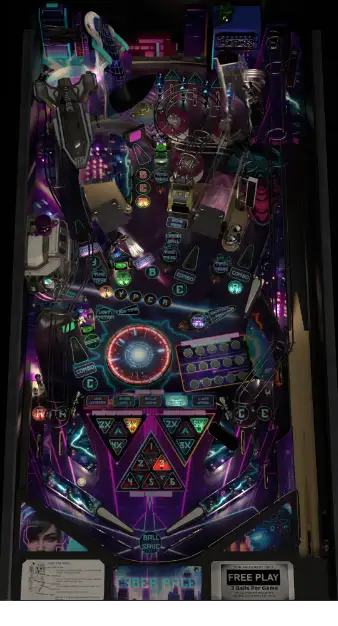

# Cyber Race (Original 2023)

---

## Files
| File Type | Link | Version | Author(s) | 
|-----------|--------|----------|--------------|
| **VPX** | [vpuniverse](https://vpuniverse.com/files/file/17837-cyberrace-flux-original-2023/) | 1.3.8 | Flux, Karl Casey, Sixtoe |
| **B2S** | [vpuniverse](https://vpuniverse.com/files/file/17823-cyberrace-original-2023-b2s/) | 1.0.0 | HauntFreaks, Flux |
| **DMD** | [vpuniverse](https://vpuniverse.com/files/file/17837-cyberrace-flux-original-2023/) | 1.3.8 | Flux, Karl Casey, Sixtoe |

**Tested by:** Curt

---

## Status 

| Backglass | DMD | ROM Required | Has Puppack | FPS |
|-----------|-----|-----|-----|-----|
| ✅ | ❌ | ❌ | ❌ | 53 |

---

## Instructions

- Install this table through the Table Manager, using the `Add Table` > `Manual` page
- If you need help, more infomation found on the wiki: [TM - Add Table - Manual](https://github.com/LegendsUnchained/vpx-standalone-alp4k/wiki/%5B04%5D-%F0%9F%A7%A1-TM-%E2%80%90-Other-Features#add-table---manual)
- Click `GO TO TABLE` after adding, and the TM will open to the relevant table folder. Copy the `music` and `CyberRaceDMD` folders that you got with the VPX to the table folder.
- "Choose your race opponent"
