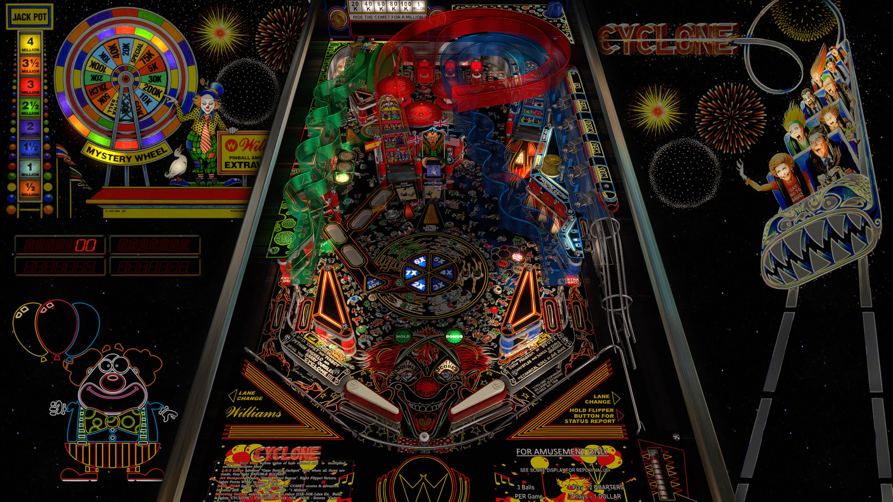

# JP's Cyclone (Williams 1988)

Authors: [jpsalas](https://www.vpforums.org/index.php?s=543a5ca562cc33a89debe8ace8834f1e&showuser=277)  
Version: 5.5.1  
Download: [VP Forums](https://www.vpforums.org/index.php?app=downloads&showfile=16626)

DirectB2S

Authors: [2borG](https://www.vpforums.org/index.php?showuser=43712)  
Version: 1.1  
Download: [VP Forums](https://www.vpforums.org/index.php?app=downloads&showfile=15163)

ROM

Download: [VP Forums](https://www.vpforums.org/index.php?app=downloads&showfile=907)  
ROM Name: cycln_l5  
MD5: ed9587500313901fc287419aa24d0b7e

## Status 

Minimum VPX Standalone build: 10.8.0-1989-a764013

| Playfield | Controls | Backglass | DMD | ROM Required | FPS | 
|-----------|----------|-----------|-----|--------------|-----|
| :white_check_mark: | :white_check_mark: | :white_check_mark: | :white_check_mark: | :white_check_mark: | 45 |

## Instructions

- Install this table through the Table Manager, using the `Add Table` > `Manual` page
- If you need help, more infomation found on the wiki: [TM - Add Table - Manual](https://github.com/LegendsUnchained/vpx-standalone-alp4k/wiki/%5B04%5D-%F0%9F%A7%A1-TM-%E2%80%90-Other-Features#add-table---manual)
- If the table requires any additional files/steps, click `GO TO TABLE` after adding, and the TM will open to the relevant table folder.

